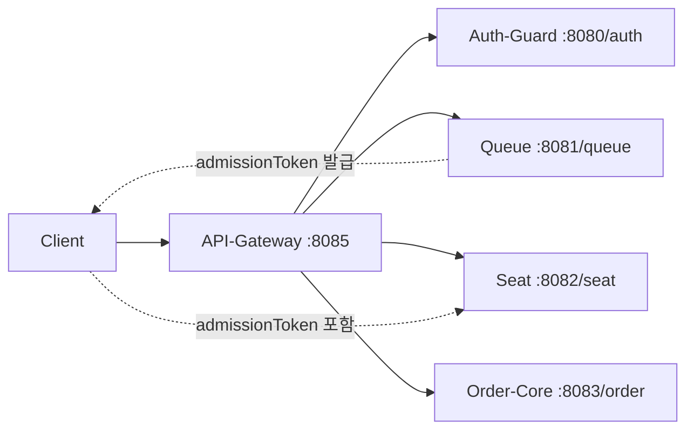

# goormgb-backend

구름공방 백엔드 레포지토리

## 목차

- [커밋 메시지 규칙](#커밋-메시지-규칙)
- [PR 작성 규칙](#pr-작성-규칙)
- [PR 승인 규칙](#pr-승인-규칙)
- [브랜치 전략](#브랜치-전략)
- [브랜치 보호 규칙](#브랜치-보호-규칙)
- [프로젝트 개요 및 개발 가이드](#프로젝트-개요-및-개발-가이드)

---

## 커밋 메시지 규칙

### 7가지 규칙

1. **타입은 영어 소문자로 작성**
2. 제목과 본문은 **빈 줄(엔터)**로 구분
3. 제목은 **50자 이내 한글로 작성**
4. 제목 끝에 마침표(`.`)를 찍지 않는다
5. 제목은 **명령문 형태**, **과거형 금지**
6. 본문 각 행은 **72자 이내**
7. **무엇을 작업 했는지** 설명 (어떻게는 PR에 기술)

### 타입 분류

| 타입           | 설명                    |
|--------------|-----------------------|
| **feat**     | 새로운 기능 추가             |
| **fix**      | 버그 수정                 |
| **build**    | 빌드 관련 변경 (모듈 설치/삭제 등) |
| **chore**    | 자잘한 변경 (코드 영향 없음)     |
| **ci**       | CI/CD 관련 설정 변경        |
| **docs**     | 문서 수정                 |
| **style**    | 포맷팅, 세미콜론 등 비기능적 수정   |
| **refactor** | 코드 리팩터링               |
| **test**     | 테스트 코드 추가/수정          |
| **perf**     | 성능 개선                 |

### 커밋 메시지 구조

```
타입(스코프): 제목

본문

바닥글
```

- **Header(필수)**, Body/Footer(선택)
- 스코프 예: auth, order, product, build, deps (선택)
- Footer: 참조 정보 (예: `resolves: #1137`), 이슈번호 (예: `fixes: #42`)

### 커밋 메시지 예시

```
feat(order): 주문 생성 API 구현

- 주문 요청 DTO 생성
- 주문 생성 시 재고 차감 로직 추가

fixes: #121
```

---

## PR 작성 규칙

> **핵심 철학: "이 PR에서 내가 한 일 목록 + 그 의도"**

### PR 제목 형식

```
[type](scope): subject
```

### PR 본문 템플릿

```markdown
## 🔧 작업 내용
- 무엇을 개발했는지
- 어떤 문제를 해결했는지
- 왜 이런 방식으로 구현했는지

## 🧩 구현 상세 (선택)
- 핵심 로직 설명
- 설계 / 구조 / 알고리즘 / 모델 선택 이유
- 트레이드오프 또는 고민했던 지점

### 📌 관련 Jira Issue
- GRGB-XX

## 🧪 테스트 방법 (선택)
- 테스트 대상
- Endpoint / 함수 / 스크립트
- 파라미터 및 체크 포인트

## ❗ 참고 사항
- 리뷰 시 유의할 점
- 후속 작업 예정
- 배포 시 주의 사항
```

### PR 작성 예시 (백엔드)

```markdown
제목: feat(order): 주문 생성 API 구현

## 🔧 작업 내용
- 주문 생성 API를 신규 구현했습니다.
- 장바구니/바로구매 주문 흐름을 하나의 API로 통합했습니다.
- 주문 시점의 배송 정보를 스냅샷으로 저장해 이후 변경에 영향을 받지 않도록 설계했습니다.

## 🧩 구현 상세 (선택)
- 주문 요청 시 addressId를 기준으로 배송지 정보를 조회하여 Receiver로 복사 저장했습니다.
- 재고 차감은 동시성 이슈를 방지하기 위해 서비스 레벨에서 처리했습니다.
- 주문 타입에 따라 장바구니 정리 로직을 분기 처리했습니다.

### 📌 관련 Jira Issue
- GRGB-46

## 🧪 테스트 방법
- 주문 생성 API 테스트
- Endpoint: POST /api/orders
- 정상 주문 / 재고 부족 / 포인트 초과 사용 케이스 확인

## ❗ 참고 사항
- 추후 결제 도메인과의 이벤트 연계가 예정되어 있습니다.
```

---

## PR 승인 규칙

> 코드 리뷰는 단순히 잘못을 찾는 과정이 아니라, **팀의 지식을 공유**하고 **코드 품질을 상향 평준화하는 과정**입니다.

### 기본 원칙

- **승인 조건**: 최소 **1명 이상의 Approve**가 있어야 merge 가능
- **예외**: 운영 장애 대응을 위한 긴급 Hotfix
- 리뷰어는 **건설적이고 맥락이 있는 피드백** 제공
- 작업자는 피드백을 **개선의 기회로 받아들이는 태도** 유지

### 백엔드 PR 리뷰 담당

- **주요(Maintainer) 작업자**: `강슬기`, `유의진`
- **Core Contributor**: `황시연` (풀스택)
- **리뷰 참여자**: `강슬기`, `유의진`, `황시연`

### 리뷰 포인트

- API 설계 일관성
- 트랜잭션/예외 처리
- 도메인 책임 분리
- 성능 및 확장성 고려 여부

> 백엔드 PR은 **최소 1명 이상(가능하면 도메인 외 1명 포함)** 리뷰 후 승인

---

## 브랜치 전략

### 주요 브랜치 (Protected)

```
feat/fix/docs (작업 브랜치)
        ↓ PR Squash & Merge
       dev (개발/Dev)
        ↓ PR Squash & Merge
       main (운영/Prod)
        ↑
    hotfixes/* (긴급 수정) ← main에서 분기
```

| 브랜치            | 설명                                        |
|----------------|-------------------------------------------|
| **main**       | 운영 배포 브랜치. 직접 커밋 금지. PR로만 반영              |
| **dev**        | 기능 통합 브랜치. feature들이 모이는 곳 (개발/알파 환경 테스트) |
| **feat/***     | 기능 개발 브랜치 (예: feat/order-create)          |
| **hotfixes/*** | 운영(main)에서 터진 긴급 수정 브랜치                   |

### 백엔드 Merge Flow (작업 절차)

1. **기능 개발**: dev → feat/* 생성
2. **기능 완료**: feat/* → dev PR (Squash)
3. **배포**: dev → main PR (Squash)
4. **운영 긴급 수정**: main → hotfixes/* 생성
5. **핫픽스 반영**: hotfixes/* → main 머지 후 **반드시 dev에도 동일 변경 반영**

> ⚠️ (5)이 빠지면 다음 배포 때 **핫픽스가 덮여서 버그 재발**

### 작업 브랜치 네이밍 규칙

- **형식**: `타입/작업-요약`
- **규칙**:
    - 영문 소문자
    - 공백 대신 하이픈(-)
    - "무엇을" 중심으로 짧게

**예시**:

- `feat/order-create-api`
- `fix/payment-amount-calc`
- `refactor/auth-service-layer`
- `docs/api-spec-order`

### Merge 방식

| 상황        | Merge 방식                          |
|-----------|-----------------------------------|
| 일반 PR     | **Squash & Merge**                |
| Hotfix PR | **Merge Commit** (운영 장애 대응 이력 확보) |

**Squash 사용 이유**:

- 브랜치 간 히스토리가 "PR 단위"로만 남아 추적이 쉬움
- 잔 커밋이 dev/main 로그를 오염시키지 않음
- 릴리즈 단위 회귀/롤백 시 "어떤 PR이 들어갔는지" 바로 확인 가능

### Hotfix 정책

1. **브랜치 생성**: main에서 `hotfixes/*` 분기
2. **반영 순서**:
    - hotfixes/* → main (Merge Commit)
    - hotfixes/* → dev (Backport)

### Merge 충돌 해결 원칙

- **로컬에서 해결** 후 push → PR 업데이트
- GitHub 웹 에디터로 충돌 해결 금지
- 충돌이 잦다면: 로컬에서 `merge dev`로 해결 후 정리

---

## 브랜치 보호 규칙

| 항목                                  | 설정          | 설명                     |
|-------------------------------------|-------------|------------------------|
| Restrict deletions                  | ✅           | main 브랜치 삭제 금지         |
| Require linear history              | ✅           | Merge 시 커밋 히스토리 일관성 유지 |
| Require pull request before merging | ✅           | PR을 통해서만 병합 가능         |
| Required approvals                  | ✅ 1명        | 최소 1명의 리뷰어 승인 필요       |
| Require conversation resolution     | ✅           | 리뷰 코멘트 모두 해결 후 머지 가능   |
| Block force pushes                  | ✅           | 강제 푸시 금지               |
| Allowed merge methods               | Squash only | Squash만 허용 (Hotfix 제외) |
| Allow auto-merge                    | ✅           | 조건 충족 시 자동 merge       |
| Always suggest updating PR branches | ✅           | 베이스 브랜치 변경 시 업데이트 제안   |

### 요약

| 항목       | 규칙                                 |
|----------|------------------------------------|
| Merge 방법 | PR + 1명 승인                         |
| 금지       | main 직접 푸시 / force push            |
| Merge 방식 | Squash only (Hotfix는 Merge Commit) |
| 자동 병합    | 보호 규칙 성립 + PR 승인 후 자동 Squash 병합    |

---

## 프로젝트 개요 및 개발 가이드

`goormgb-backend`는 야구 경기 예매 서비스의 백엔드 시스템을 구성하는 멀티 모듈 레포지토리입니다.  
API Gateway를 단일 진입점으로 두고, 인증(`Auth-Guard`)·대기열(`Queue`)·좌석(`Seat`)·주문/결제(`Order-Core`)를 서비스 책임 단위로 분리해 운영합니다.

핵심 사용자 흐름은 `로그인 → 대기열 진입 → 좌석 선택/선점 → 주문 생성 → 결제/예매 확정`이며, 각 단계는 토큰 검증과 도메인 상태 검증으로 연결됩니다.  
또한 공통 모듈(`common-core`)에서 예외 응답 포맷, 공통 도메인, 보안/관측 설정을 공유해 서비스 간 일관성을 유지합니다.

### 빠른 시작

#### 1) 사전 준비

- JDK 21
- Docker Desktop
- 프로젝트 루트 `.env` 파일 준비

#### 2) Docker로 전체 실행

```bash
cd docker
docker compose --env-file ../.env -f docker-compose.yml -f docker-compose.local.yml up --build -d
```

#### 3) 상태 확인

```bash
docker compose ps
docker compose logs -f api-gateway
```

#### 4) 종료

```bash
docker compose down
```

### 시스템 구성

#### 기술 스택

- Java 21
- Spring Boot 4.0.2
- Gradle 멀티모듈
- PostgreSQL
- Redis
- Kafka
- Spring Security, Spring Data JPA
- Spring Cloud Gateway(WebFlux)
- SpringDoc(OpenAPI)
- Actuator + Prometheus(Micrometer)

#### 서비스 요청 흐름



#### 모듈 구성

| 모듈          | 역할                               | 기본 포트 | Context Path |
|-------------|----------------------------------|------:|--------------|
| API-Gateway | 진입점, 라우팅, CORS, Rate Limiting    |  8085 | -            |
| Auth-Guard  | 인증/인가, 토큰 발급/재발급, 사용자 상태         |  8080 | `/auth`      |
| Queue       | 대기열 진입/상태 조회, Admission Token 발급 |  8081 | `/queue`     |
| Seat        | 좌석 조회/선점/추천                      |  8082 | `/seat`      |
| Order-Core  | 경기/주문/결제/마이페이지                   |  8083 | `/order`     |
| common-core | 공통 도메인/보안/예외/설정 라이브러리            |     - | -            |

### 모듈별 핵심 서비스 상세

#### API-Gateway

| 항목     | 내용                                                                                                                              |
|--------|---------------------------------------------------------------------------------------------------------------------------------|
| 핵심 책임  | 외부 진입점, 라우팅, CORS, JWT 검증, 요청 제한                                                                                                |
| 주요 기능  | 서비스 라우팅(`/auth/**`, `/queue/**`, `/seat/**`, `/order/**`), 대기열 진입 API Rate Limiting(`/queue/matches/*/enter`), 전역 필터 기반 보안/모니터링 |
| 의존 인프라 | Redis(요청 제한), JWT 공개키 검증                                                                                                        |
| 대표 경로  | `POST /queue/matches/{matchId}/enter`(제한 적용), `GET /swagger-ui/index.html`                                                      |

#### Auth-Guard

| 항목       | 내용                                                                                                                                    |
|----------|---------------------------------------------------------------------------------------------------------------------------------------|
| 핵심 책임    | 인증/인가, 토큰 라이프사이클 관리, 사용자 상태 관리                                                                                                        |
| 주요 기능    | 카카오 OAuth 로그인/회원가입, Access/Refresh 토큰 발급·재발급, 로그아웃(블랙리스트/쿠키 처리), 내 정보 조회, 사용자 차단/해제(내부 API)                                           |
| 의존 인프라   | PostgreSQL(유저), Redis(세션/토큰), Kafka(이벤트), JWT 키쌍                                                                                      |
| 대표 엔드포인트 | `POST /auth/kakao/login`, `POST /auth/token/refresh`, `POST /auth/logout`, `GET /auth/me`, `POST /auth/internal/users/{userId}/block` |

#### Queue

| 항목       | 내용                                                                           |
|----------|------------------------------------------------------------------------------|
| 핵심 책임    | 경기별 대기열 상태 관리 및 입장 토큰(Admission Token) 발급                                    |
| 주요 기능    | 대기열 진입, 순번/상태 조회, READY 전환 시 admissionToken 쿠키 발급, 대기열 승급 스케줄링               |
| 의존 인프라   | Redis(대기열 핵심 저장소), PostgreSQL(보조 조회), Admission JWT 키쌍                       |
| 대표 엔드포인트 | `POST /queue/matches/{matchId}/enter`, `GET /queue/matches/{matchId}/status` |

#### Seat

| 항목       | 내용                                                                                                                                              |
|----------|-------------------------------------------------------------------------------------------------------------------------------------------------|
| 핵심 책임    | 좌석 조회/선점/추천 및 좌석 가용 상태 관리                                                                                                                       |
| 주요 기능    | 좌석 그룹 초기 조회, 섹션-블록 좌석 현황 조회, 좌석 선점(Hold), 선호 기반 좌석 추천/배정, 선점 만료 정리 스케줄러                                                                         |
| 의존 인프라   | PostgreSQL(좌석/경기), Redis(캐시·세션), Redis Queue(대기열 연계), Kafka(결제/취소 이벤트), Redisson(분산락)                                                           |
| 대표 엔드포인트 | `GET /seat/matches/{matchId}/seat-groups`, `POST /seat/matches/{matchId}/seat-holds`, `GET /seat/matches/{matchId}/sections/{sectionId}/blocks` |

#### Order-Core

| 항목       | 내용                                                                                                                                           |
|----------|----------------------------------------------------------------------------------------------------------------------------------------------|
| 핵심 책임    | 경기/구단 조회, 주문/결제 처리, 마이페이지 및 온보딩 선호도 관리                                                                                                       |
| 주요 기능    | 경기/구단 조회 API, 주문 생성/조회, 결제 및 입금만료 처리, 마이페이지(티켓/문의/계정), 온보딩 선호도 CRUD                                                                          |
| 의존 인프라   | PostgreSQL(주문/결제/도메인), Redis(캐시), Kafka(주문/결제 이벤트), Mail(SMTP)                                                                               |
| 대표 엔드포인트 | `GET /order/matches`, `POST /order/orders`, `POST /order/payments/process`, `GET /order/mypage/profile`, `GET /order/onboarding/preferences` |

#### common-core

| 항목     | 내용                                                                                                      |
|--------|---------------------------------------------------------------------------------------------------------|
| 핵심 책임  | 공통 도메인 모델/리포지토리, 예외/응답 포맷, 보안/설정 공통화                                                                    |
| 주요 기능  | `ApiResult` 표준 응답, `GlobalExceptionHandler`, 공통 엔티티(User/Match/Club 등), Kafka 이벤트 모델, 보안/관측 공통 설정       |
| 의존 인프라 | 각 모듈에서 전이되어 함께 사용됨(JPA/Security/Redis/Kafka/Validation)                                                 |
| 대표 패키지 | `com.goormgb.be.global.*`, `com.goormgb.be.domain.*`, `com.goormgb.be.user.*`, `com.goormgb.be.kafka.*` |

### 데이터/인프라 의존성 표

| 모듈          | PostgreSQL             | Redis                       | Kafka                         |
|-------------|------------------------|-----------------------------|-------------------------------|
| API-Gateway | 미사용                    | Rate Limiter 저장소로 사용        | 미사용                           |
| Auth-Guard  | 사용자/인증 관련 영속 데이터 저장    | 세션/토큰(블랙리스트 포함) 관리          | 사용자 상태 변경 등 이벤트 발행/소비 연계      |
| Queue       | 대기열 진입 전 유효성 보조 조회     | 대기열 순번/상태/READY 토큰의 핵심 저장소  | 미사용                           |
| Seat        | 좌석/경기/선점 데이터 저장        | 응답 캐시/세션 및 대기열 연계용 Redis 사용 | 결제완료/주문취소 등 이벤트 소비로 좌석 상태 동기화 |
| Order-Core  | 주문/결제/마이페이지/온보딩 데이터 저장 | 조회 성능용 캐시                   | 결제/주문 도메인 이벤트 발행 및 후속 처리 소비   |
| common-core | 공통 엔티티/리포지토리 모델 제공     | 공통 설정/유틸 제공                 | 공통 이벤트 모델/토픽 정의 제공            |

### 보안/인증 규칙 요약

#### 토큰 역할

| 항목             | 역할                     | 저장 위치                      | 주요 발급 주체   |
|----------------|------------------------|----------------------------|------------|
| Access Token   | 사용자 인증(인가 헤더)          | 클라이언트 메모리/스토리지(프론트 정책에 따름) | Auth-Guard |
| Refresh Token  | Access Token 재발급       | HttpOnly Cookie            | Auth-Guard |
| admissionToken | 좌석 선택 진입 권한(대기열 통과 증명) | HttpOnly Cookie            | Queue      |

#### 검증 지점

- Access Token
    - API-Gateway에서 JWT 검증 후 downstream으로 전달됩니다.
    - 각 서비스의 보안 컨텍스트에서 `@AuthenticationPrincipal` 사용 API는 유효 사용자 전제를 가집니다.
- Refresh Token
    - `Auth-Guard`의 토큰 재발급/로그아웃 API에서 쿠키를 추출해 검증합니다.
    - 재발급 성공 시 새 Refresh Token 쿠키를 다시 내려줍니다.
- admissionToken
    - `Queue` 상태 조회에서 READY 상태일 때 쿠키로 발급됩니다.
    - `Seat`의 주요 API(좌석 그룹 조회/선점/섹션 블록 조회)에서 `AdmissionTokenValidator`로 검증합니다.

#### API 호출 전제조건

- 보호 API 호출 시 `Authorization: Bearer <access-token>` 필요
- 좌석 API 호출 시 `admissionToken` 쿠키 필요(대기열 통과 이후)
- 토큰 만료/위조/불일치 시 401 또는 도메인 오류 응답

### 실행/개발 가이드

#### Swagger UI

- 통합(게이트웨이): `http://localhost:8085/swagger-ui/index.html`

#### 로컬 실행 (서비스별)

```bash
./gradlew :Auth-Guard:bootRun --args='--spring.profiles.active=local'
./gradlew :Queue:bootRun --args='--spring.profiles.active=local'
./gradlew :Seat:bootRun --args='--spring.profiles.active=local'
./gradlew :Order-Core:bootRun --args='--spring.profiles.active=local'
./gradlew :API-Gateway:bootRun --args='--spring.profiles.active=local'
```

#### 빌드/테스트 명령어

```bash
./gradlew clean build
./gradlew test
./gradlew :Seat:test
./gradlew :Queue:test
```

#### 환경 변수 가이드

로컬/도커 실행 시 `.env`를 통해 아래 항목을 주입합니다.

- 공통: `DB_URL`, `DB_USERNAME`, `DB_PASSWORD`, `REDIS_HOST`, `REDIS_PORT`
- 인증: `JWT_PRIVATE_KEY`, `JWT_PUBLIC_KEY`, `JWT_ISSUER`, `JWT_ACCESS_TOKEN_AUDIENCE`
- 대기열: `ADMISSION_PRIVATE_KEY`, `ADMISSION_PUBLIC_KEY`
- 카프카: `KAFKA_BOOTSTRAP_SERVERS` 및 producer/consumer 관련 키
- 메일(Order-Core): `MAIL_HOST`, `MAIL_PORT`, `MAIL_USERNAME`, `MAIL_PASSWORD`, `MAIL_FROM`, `MAIL_FROM_NAME`
- Gateway 라우팅: `AUTH_GUARD_URL`, `QUEUE_URL`, `SEAT_URL`, `ORDER_CORE_URL`

### 운영/관측

- 각 서비스에 Actuator 활성화
- 메트릭 수집: Prometheus(Micrometer)
- JSON 로그 인코더 사용

