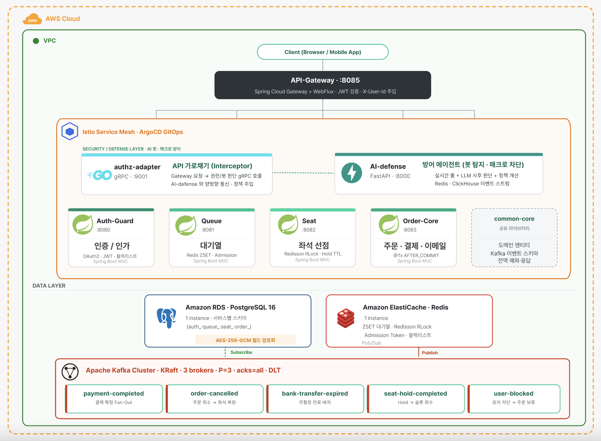
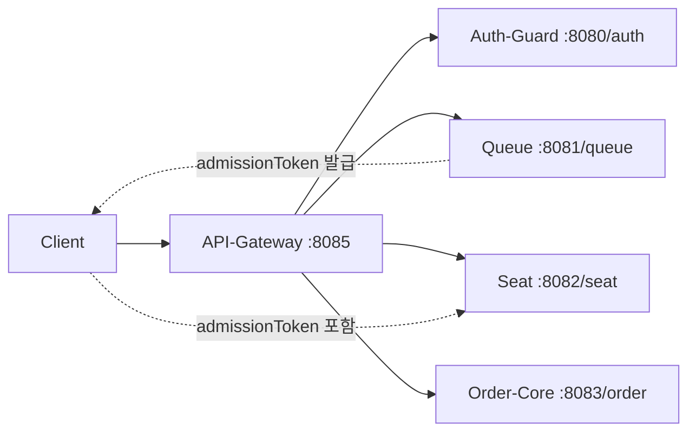

# goormgb-backend

구름공방 백엔드 레포지토리

## 목차

- [프로젝트 소개](#프로젝트-소개)
- [서비스 구조](#서비스-구조)
- [기술 스택](#기술-스택)
- [핵심 비즈니스 흐름](#핵심-비즈니스-흐름)
- [주요 기능](#주요-기능)
- [실행 가이드](#실행-가이드)
- [데이터베이스 · ERD](#데이터베이스--erd)
- [보안/인증 규칙](#보안인증-규칙)
- [커밋 메시지 규칙](#커밋-메시지-규칙)
- [PR 작성 규칙](#pr-작성-규칙)
- [PR 승인 규칙](#pr-승인-규칙)
- [브랜치 전략](#브랜치-전략)
- [브랜치 보호 규칙](#브랜치-보호-규칙)

---

## 프로젝트 소개

> 야구 경기 예매 서비스의 인증, 대기열, 좌석, 주문/결제를 담당하는 백엔드 레포지토리입니다.  
> 예매 트래픽이 집중되는 구간을 안정적으로 제어하기 위해 서비스 책임을 모듈 단위로 분리해 운영합니다.

`goormgb-backend`는 Spring Boot 기반 멀티 모듈 구조로, API Gateway를 단일 진입점으로 사용합니다.
핵심 사용자 흐름은 `로그인 → 대기열 진입 → 좌석 선택/선점 → 주문 생성 → 결제/예매 확정`이며,
각 단계는 토큰 검증과 도메인 상태 검증으로 연결됩니다.

## Developers

|                                        백엔드                                        |                                        백엔드                                        |                                       풀스택                                       |
|:---------------------------------------------------------------------------------:|:---------------------------------------------------------------------------------:|:-------------------------------------------------------------------------------:|
|  |  |  |
|              강슬기 <br/> [@SeulGi0117](https://github.com/SeulGi0117)               |                  유의진 <br/> [@ejinn1](https://github.com/ejinn1)                   |               황시연 <br/> [@siyeon13](https://github.com/siyeon13)                |

## 서비스 구조

`goormgb-backend`는 모듈별 책임을 분리한 구조입니다.

```text
goormgb-backend
├── API-Gateway   # 외부 요청 진입점, 라우팅, JWT 검증, Rate Limiting
├── Auth-Guard    # 로그인, 토큰 발급/재발급, 사용자 상태 관리
├── Queue         # 대기열 진입, 순번/상태 조회, admissionToken 발급
├── Seat          # 좌석 조회/선점, 좌석 추천, 좌석 상태 관리
├── Order-Core    # 경기/구단 조회, 주문/결제, 마이페이지, 온보딩
└── common-core   # 공통 도메인, 응답 포맷, 예외, 보안/관측 설정
```

> 📘 **상세 설계 문서**: [MSA 아키텍처 현재 문서](docs/아키텍쳐/msa-architecture-current.md)
> — 6개 모듈의 패키지 트리 · 포트 · Kafka 토픽 4종 · X-User-Id 인증 흐름 · 티켓팅 전체 시퀀스 · 27개 엔티티 5 Bounded Context 정리
>
> 🔒 **보안 현황 문서**: [PlayBall 보안 방어 체계 현황](docs/구름공방-백엔드-보안상황.md)
> — JWT RSA256 · Admission Token · AES-256-GCM 필드 암호화 · 침투테스트 6건 대응 (2026-04-18 머지 완료) · Phase 1~4 최적화 반영
>
> 📊 **부하테스트 정리 문서**: [부하테스트 3일차 통합](docs/부하테스트-정리/README.md)
> — Phase 0 → Phase 4 최적화 타임라인 · 503 트러블슈팅 스토리 · 테스트 시나리오 Flow · 기술 용어 해설 · Before/Middle/After 시각화 비교 (이미지 81장 포함)

### 프로젝트 아키텍처 (Project Architecture)



## 요청 흐름



## 기술 스택

각 기술은 **검토한 대안 · 채택하게 된 계기 · 공식 근거**를 함께 기록합니다.
버전은 실제 레포지토리 `build.gradle`에 명시된 값이며, Spring Boot 4.0.2 BOM이 관리하는 라이브러리는 `BOM 관리`로 표기하였습니다 (2026-04-21 기준).

---

### Language & Build


<table>
<thead><tr><th>기술</th><th>버전</th><th>검토 대안 → 채택 이유</th></tr></thead>
<tbody>

<tr><td><b>Java</b></td><td><code>21</code> (toolchain)</td>
<td>
Spring Boot 4.0 도입을 결정한 뒤 확인한 결과, 4.0의 권장 baseline과 정합(Java 17 최소 · 21 LTS 권장)하여 Java 21을 유지하였습니다.<br><br>
신규 기능인 Virtual Threads(<a href="https://openjdk.org/jeps/444">JEP 444</a>), Record Patterns(<a href="https://openjdk.org/jeps/440">JEP 440</a>), Pattern Matching for switch(<a href="https://openjdk.org/jeps/441">JEP 441</a>)는 향후 활용 여지로 남겨두었습니다.<br><br>
<b>출처</b>: <a href="https://www.oracle.com/java/technologies/javase/21all-relnotes.html">JDK 21 LTS Release Notes</a>
</td></tr>

<tr><td><b>Spring Boot</b></td><td><code>4.0.2</code></td>
<td>
<b>초기 후보는 3.5.7</b>이었습니다 (이전 교육 과정 표준).<br><br>
프로젝트를 MSA로 구현하기로 결정한 뒤 버전을 재검토하였고, 2026-01-22에 릴리즈된 <b>4.0.2가 MSA 환경에 유리하다는 근거</b>를 확인하여 전환하였습니다.<br><br>
<b>MSA 환경의 주요 개선점</b><br>
① Declarative HTTP Interface Client + Circuit Breaker 자동 통합<br>
② API Versioning Predicate (Spring Cloud Gateway 5.0)<br>
③ 4개 임베디드 서버 Graceful Shutdown — K8s SIGTERM 시 결제·좌석 Hold 안전 종료<br>
④ JSpecify null-safety 전면 적용으로 서비스 간 DTO 계약의 NPE 위험 차단<br>
⑤ AOT/GraalVM Native Image 개선<br><br>
<b>출처</b>: <a href="https://spring.io/blog/2026/01/22/spring-boot-4-0-2-available-now/">Spring Boot 4.0.2 발표</a> · <a href="https://github.com/spring-projects/spring-boot/wiki/Spring-Boot-4.0-Release-Notes">4.0 Release Notes</a>
</td></tr>

<tr><td><b>Spring Cloud</b></td><td><code>2025.1.1</code> (Oakwood)</td>
<td>
Spring Boot 4.0.x의 <b>공식 호환 릴리즈 트레인</b>입니다.<br><br>
2025.0(Moorgate)은 Boot 4.0.1 미만과만 호환되어 사용할 수 없었고, Boot 4.0.2의 짝은 2025.1(Oakwood)로 확정하였습니다.<br><br>
<b>출처</b>: <a href="https://spring.io/blog/2026/01/29/spring-cloud-2025-1-1-aka-oakwood-has-been-released/">Oakwood 릴리즈 발표</a>
</td></tr>

<tr><td><b>Spring Dependency Management</b></td><td><code>1.1.7</code></td>
<td>
루트 <code>subprojects</code> 블록에서 BOM을 자동 적용하여, 5개 모듈의 의존성 관리를 일원화하였습니다.
</td></tr>

<tr><td><b>Gradle Multi-module</b></td><td>—</td>
<td>
최초 모놀리식으로 시작한 뒤 MSA로 전환하는 과정에서, 루트 + 5개 서비스(API-Gateway · Auth-Guard · Queue · Seat · Order-Core) + common-core 라이브러리 모듈을 하나의 프로젝트로 통합 빌드하기 위해 채택하였습니다.
</td></tr>

</tbody></table>

### Framework · Web · API


<table>
<thead><tr><th>기술</th><th>버전</th><th>검토 대안 → 채택 이유</th></tr></thead>
<tbody>

<tr><td><b>Spring Cloud Gateway (WebFlux)</b></td><td><code>spring-cloud-starter-gateway-server-webflux</code> (2025.1.1)</td>
<td>
<b>도입 배경</b><br>
모놀리식에서 멀티모듈로 분리한 뒤 두 가지 문제가 동시에 발생하였습니다.<br><br>
① JWT 검증 코드가 모든 모듈에 중복되었습니다. Auth-Guard로 옮기면 다른 모듈이 인증 불가였고, common-core로 빼면 모든 모듈에 공통 필터가 중복 배치되었습니다.<br>
② Swagger가 4개 서비스마다 따로 떠 있어 프론트엔드가 링크 4개를 열어야 했습니다.<br><br>
<b>검토 대안</b><br>
① K8s Ingress만으로 JWT 처리 — Lua 스크립트 복잡도가 과했습니다.<br>
② Nginx — Spring 생태계 통합이 부족하였습니다.<br><br>
<b>채택 후 효과</b><br>
· JWT 중앙 검증 + <code>X-User-Id</code> 헤더 주입으로 다운스트림은 파싱이 불필요해졌습니다.<br>
· 한 URL에서 5개 API 문서를 드롭다운으로 통합 조회할 수 있게 되었습니다.<br>
· WebFlux 논블로킹 I/O로 동시 처리량을 확보하였습니다.<br><br>
<b>출처</b>: <a href="https://spring.io/projects/spring-cloud-gateway">Spring Cloud Gateway 5.0</a>
</td></tr>

<tr><td><b>Spring Data JPA</b></td><td>BOM 관리</td>
<td>
<b>검토 대안</b><br>
① MyBatis — SQL 자유도는 높으나 보일러플레이트가 과다합니다.<br>
② JOOQ — 타입 안전 쿼리 작성이 가능하나 팀 학습 부담이 컸습니다.<br>
③ QueryDSL — JPA 기반 동적 쿼리 확장.<br><br>
<b>채택 이유</b><br>
팀 전원이 이전 교육 과정에서 JPA 학습을 완료한 상태였고, Spring Boot Auto-configuration과 Hibernate 7(Jakarta EE 11)이 기본 탑재되어 있었습니다.<br><br>
2개월 내 5개 모듈 완성이 우선순위였기에, 학습 곡선이 가장 낮은 JPA로 통일하였습니다.
</td></tr>

<tr><td><b>Spring Security</b></td><td>BOM 관리</td>
<td>
Spring Cloud Gateway JWT 필터 체인과 Auth-Guard의 OAuth2 Resource Server/Client에 이미 통합되어 있는 표준이었습니다.<br><br>
별도 인증 프레임워크를 구축할 여력이 없었고, 레퍼런스와 트러블슈팅 자료가 가장 풍부하여 채택하였습니다.
</td></tr>

<tr><td><b>SpringDoc OpenAPI</b></td><td><code>3.0.1</code></td>
<td>
Swagger UI 자동 생성 라이브러리 중 <b>WebMVC(<code>springdoc-openapi-starter-webmvc-ui</code>)와 WebFlux(<code>starter-webflux-ui</code>)를 동시에 지원하는 유일한 라이브러리</b>입니다.<br><br>
Gateway는 WebFlux, 나머지 4개 서비스는 WebMVC 혼합 환경이었기 때문에, 하나의 라이브러리 계열로 통합 문서화를 구성하기 위해 채택하였습니다.
</td></tr>

</tbody></table>

### Database


<table>
<thead><tr><th>기술</th><th>버전</th><th>검토 대안 → 채택 이유</th></tr></thead>
<tbody>

<tr><td><b>PostgreSQL</b></td><td><code>16</code> (AWS RDS <code>db.t4g.small</code>)</td>
<td>
<b>초기 후보는 MySQL 8</b>이었습니다 (이전 교육 과정 표준).<br><br>
클라우드팀에서 백엔드와 AI가 <b>DB를 공유해야 한다</b>고 전달하였고, AI팀이 벡터·JSON 확장을 위해 <b>PostgreSQL을 요구</b>하여 합의로 전환하였습니다.<br><br>
<b>전환 후 확인한 PG의 MSA 친화 기능</b><br>
① Advisory Lock — 좌석 Hold·중복 결제의 보조 상호배제<br>
② 부분/표현식 인덱스 — <code>WHERE status='READY'</code> 같은 상태 편향 쿼리 최적화<br>
③ Transactional DDL — 마이그레이션 원자 롤백 (MySQL은 대부분 암묵적 커밋)<br>
④ 논리 복제(컬럼/행 필터) — 분석/AI 파이프라인 CDC 연계 용이<br>
⑤ 선언적 파티셔닝<br>
⑥ JSONB + GIN 인덱스<br><br>
<b>출처</b>: <a href="https://www.postgresql.org/docs/current/">PostgreSQL Docs</a> · <a href="https://aws.amazon.com/compare/the-difference-between-mysql-vs-postgresql/">AWS PG vs MySQL</a>
</td></tr>

<tr><td><b>PostgreSQL JDBC Driver</b></td><td>BOM 관리 (<code>org.postgresql:postgresql</code>, runtime)</td>
<td>
Spring Boot 4.0.2 BOM이 관리하는 runtime 의존성을 그대로 사용하였습니다.
</td></tr>

<tr><td><b>Hibernate ORM</b></td><td>BOM 관리 (Jakarta EE 11 기반 Hibernate 7)</td>
<td>
Spring Boot 4.0의 baseline 버전이며, 팀 학습 곡선을 최소화하기 위해 그대로 채택하였습니다.
</td></tr>

</tbody></table>

### Cache · Concurrency


<table>
<thead><tr><th>기술</th><th>버전</th><th>검토 대안 → 채택 이유</th></tr></thead>
<tbody>

<tr><td><b>Caffeine</b></td><td>BOM 관리 (<code>com.github.ben-manes.caffeine:caffeine</code>)</td>
<td>
<b>도입 계기</b><br>
부하테스트 Phase 0에서 DB 커넥션 풀이 <b>270(RDS 한계)까지 고갈</b>되었고 <b>P99 6,887ms</b>를 기록하였습니다.<br>
RDS CPU·메모리는 여유가 있었기 때문에 쿼리 수 자체가 문제로 진단하였습니다.<br>
핫 쿼리 Top 7을 분석한 뒤, 정적 메타데이터(Match · Stadium · Block · Section)를 로컬 캐싱으로 제거하기로 결정하였습니다.<br><br>
<b>검토 대안</b><br>
① EhCache 3 — 설정이 무겁고 JCache 스펙 적용이 과했습니다.<br>
② Guava Cache — 유지보수가 축소되었고 이슈 #2063이 장기간 미해결 상태였습니다.<br>
③ Redis-only — 네트워크 RTT가 남아 커넥션 대기 문제를 해소할 수 없었습니다.<br><br>
<b>Caffeine 선택 이유</b><br>
· W-TinyLFU 알고리즘으로 Guava 대비 JMH 벤치 최대 25배 처리량을 보였습니다.<br>
· Spring Framework 공식 문서에 "Guava Cache의 rewrite"로 기술되어 있습니다.<br>
· Spring Boot Cache Abstraction에서 퍼스트 클래스로 지원됩니다.<br><br>
<b>결과</b><br>
Phase 1 도입 후 <b>P99 6,887ms → 2,434ms (−65%)</b>, <b>DB 커넥션 풀 사용 270 → 100 (−63%)</b>을 달성하였습니다.<br><br>
<b>출처</b>: <a href="https://github.com/ben-manes/caffeine">Caffeine</a> · <a href="https://github.com/ben-manes/caffeine/wiki/Benchmarks">벤치마크</a> · <a href="https://docs.spring.io/spring-framework/reference/integration/cache/store-configuration.html">Spring Cache 공식</a>
</td></tr>

<tr><td><b>Redis</b></td><td>BOM 관리 (<code>spring-boot-starter-data-redis</code> / <code>-reactive</code>, Lettuce 클라이언트)</td>
<td>
<b>필요 기능</b><br>
① Access/Refresh 토큰 저장 및 블랙리스트<br>
② 대기열 ZSET (순번 + Admission Token)<br>
③ 좌석 분산 락<br>
④ 분산 세션<br><br>
<b>운영 구성</b><br>
· <b>dev 환경</b>: 로컬 미니 PC 2대에 Queue용/Cache용 이중 인스턴스로 분리하여, 대기열 spike가 세션 응답 시간에 영향을 주지 않도록 부하를 격리하였습니다.<br>
· <b>prod(AWS ElastiCache)</b>: 비용 이유로 단일 인스턴스로 통합 운영 중입니다.<br><br>
환경변수 주입만으로 코드 변경 없이 두 구조를 모두 지원하도록 설계하였습니다.
</td></tr>

<tr><td><b>Redisson</b></td><td><code>org.redisson:redisson:3.44.0</code></td>
<td>
<b>초기 구성</b><br>
단순 SETNX 기반 분산 락을 사용하였습니다.<br><br>
<b>문제 발생</b><br>
좌석 배정 실측에서 TTL(5초) 만료 중 작업이 완료되지 않아 락이 이탈되었고, <b>중복 배정 사고</b>가 발생하였습니다.<br><br>
<b>Redisson RLock 전환 이유</b><br>
① Watch Dog — 작업 중 TTL을 자동 갱신합니다 (10초마다 리프레시).<br>
② 소유자 스레드 검증 (<code>isHeldByCurrentThread()</code>) — 타 스레드의 무단 해제를 차단합니다.<br>
③ <code>tryLock(waitTime, leaseTime)</code> — Pub/Sub 기반 대기로 polling이 필요하지 않습니다.<br>
④ RedLock 내장 — 클러스터 환경에 대비할 수 있습니다.<br><br>
Spring Boot 4 호환을 위해 starter 대신 <b>core 라이브러리를 직접 의존</b>하였습니다.<br><br>
<b>출처</b>: <a href="https://github.com/redisson/redisson">Redisson</a>
</td></tr>

</tbody></table>

### Messaging (EDA)


<table>
<thead><tr><th>기술</th><th>버전</th><th>검토 대안 → 채택 이유</th></tr></thead>
<tbody>

<tr><td><b>Apache Kafka</b></td><td><code>3.7.1</code> (KRaft · staging 브로커)</td>
<td>
<b>검토 대안</b><br>
RabbitMQ, AWS SQS/SNS, Redis Streams, NATS를 함께 검토하였습니다.<br><br>
<b>선택 이유 — 팀 현실</b><br>
① <b>러닝커브 최소화</b> — 백엔드 2명이 2개월 내에 MSA를 구축해야 하는 상황이었습니다. RabbitMQ/SQS는 팀 내 경험자가 없었고, Kafka는 이전 교육에서 개념을 학습한 경험이 있었습니다.<br>
② "Producer는 Consumer를 신경쓸 필요가 없는" 구조 — 발행/구독이 완전히 분리되어, 신규 Consumer 추가 시 Producer 변경이 불필요합니다.<br><br>
<b>선택 이유 — 기술</b><br>
③ At-least-once + DLT — <code>acks=all</code> ISR 복제 대기, 3회 재시도 후 <code>{topic}.DLT</code>로 격리합니다 (결제·좌석 이벤트 무유실이 필수).<br>
④ 순서 보장 — <code>key=orderId</code> 파티션 고정으로 "결제 → 취소" 역전 사고를 차단합니다.<br>
⑤ <code>@TransactionalEventListener(AFTER_COMMIT)</code> — DB 커밋 이후에만 발행하여 "DB 롤백·Kafka만 발행" 정합성 파손을 차단합니다.<br>
⑥ <b>Payment 서비스 분리 대비 선제 설계</b> — Producer 위치만 옮기면 Consumer 코드는 변경하지 않아도 됩니다.<br><br>
<b>출처</b>: <a href="https://kafka.apache.org/documentation/">Kafka Docs</a>
</td></tr>

<tr><td><b>Spring Kafka</b></td><td>BOM 관리 (<code>spring-boot-starter-kafka</code>)</td>
<td>
Kafka 클라이언트의 Spring 통합 라이브러리입니다.<br><br>
<code>KafkaTemplate</code>, <code>@KafkaListener</code>, JsonSerializer/Deserializer, Trusted Packages 역직렬화 안전성을 제공합니다.
</td></tr>

</tbody></table>

### Security · Auth


<table>
<thead><tr><th>기술</th><th>버전</th><th>검토 대안 → 채택 이유</th></tr></thead>
<tbody>

<tr><td><b>JJWT</b></td><td><code>0.13.0</code> (API-Gateway · Auth-Guard) / <code>0.12.7</code> (Queue · Seat)</td>
<td>
<b>검토 대안</b><br>
① nimbus-jose-jwt — Spring Security 내부에서 사용하지만 저수준 API로 커스텀 발급 로직이 장황합니다.<br>
② Auth0 java-jwt — JWE 미지원이고 JWK 기능도 제한적입니다.<br>
③ jose4j — 커뮤니티와 레퍼런스가 부족합니다.<br><br>
<b>JJWT 채택 이유</b><br>
① RFC 7515~7519(JWS/JWE/JWK)를 전 범위로 지원합니다.<br>
② JDK 17+ JPMS 친화적입니다 (0.13.0에서 reflection이 제거되어 <code>--add-opens</code> 플래그가 필요하지 않습니다).<br>
③ 플루언트 빌더 DSL로 발급(Auth-Guard)과 검증(5개 모듈)을 동일 라이브러리로 통일할 수 있습니다.<br>
④ Spring Boot 통합 레퍼런스가 풍부합니다.<br><br>
신규 모듈(API-Gateway · Auth-Guard)은 0.13.0을 적용하였고, 기존 모듈(Queue · Seat)은 0.12.7을 유지하였습니다.<br><br>
<b>출처</b>: <a href="https://github.com/jwtk/jjwt">JJWT</a> · <a href="https://github.com/jwtk/jjwt/releases">릴리스 노트</a>
</td></tr>

<tr><td><b>Spring OAuth2 Client</b></td><td>BOM 관리 (Spring Security 번들)</td>
<td>
카카오 OAuth2 소셜 로그인을 위해 채택하였습니다.<br><br>
자체 구현 대비 OpenID Connect 규격 준수와 토큰 갱신·세션 관리 자동화를 제공합니다.
</td></tr>

<tr><td><b>AES-256-GCM Field Encryption</b></td><td>자체 <code>EncryptionConverter</code></td>
<td>
PII 필드를 컬럼 단위로 암호화하기 위한 자체 구현입니다 (User · Order · Payment · Inquiry의 민감 정보).<br><br>
<code>@Convert(EncryptionConverter.class)</code>로 JPA 엔티티에 투명하게 매핑하였습니다.<br>
검색이 필요한 필드는 SHA-256 해시를 별도 컬럼(<code>providerUserIdHash</code>)에 저장하여 조회가 가능하도록 설계하였습니다.
</td></tr>

</tbody></table>

### Resilience · Observability


<table>
<thead><tr><th>기술</th><th>버전</th><th>검토 대안 → 채택 이유</th></tr></thead>
<tbody>

<tr><td><b>Resilience4j</b></td><td><code>io.github.resilience4j:resilience4j-spring-boot3:2.2.0</code></td>
<td>
<b>검토 대안</b><br>
① Netflix Hystrix — <a href="https://github.com/Netflix/Hystrix">2018년 maintenance mode로 공식 전환</a>되어 신규 개발이 중단되었으므로 즉시 배제하였습니다.<br>
② Spring Retry — 재시도만 지원하고 Circuit Breaker는 부가 수준이며, Rate Limiter/Bulkhead 기능이 없습니다.<br><br>
<b>Resilience4j 채택 이유</b><br>
· Hystrix의 공식 후속이며, Spring Cloud Circuit Breaker의 기본 구현체입니다.<br>
· Retry · CircuitBreaker · RateLimiter · TimeLimiter · Bulkhead 5패턴을 통합 제공합니다.<br>
· AOP 어노테이션 + Actuator 엔드포인트 + Micrometer 메트릭이 자동으로 노출됩니다.<br><br>
<b>실제 도입 계기</b><br>
Seat 모듈의 <code>BookingOptions prequeue 마커 Redis 저장</code>이 동기 retry로 <b>Tomcat 스레드 블로킹</b>을 유발하였고, Phase 4 최적화에서 <code>@Retry</code> 비동기 전환으로 해결하였습니다.<br><br>
<b>출처</b>: <a href="https://resilience4j.readme.io/">Resilience4j</a>
</td></tr>

<tr><td><b>Spring Boot Actuator</b></td><td>BOM 관리</td>
<td>Health · Metrics · Circuit Breaker 상태 엔드포인트의 표준 제공자로 채택하였습니다.</td></tr>

<tr><td><b>Micrometer Prometheus</b></td><td>BOM 관리 (<code>io.micrometer:micrometer-registry-prometheus</code>)</td>
<td>Prometheus 스크레이핑을 통해 Grafana 대시보드와 연계하기 위한 표준으로 채택하였습니다.</td></tr>

<tr><td><b>Logstash Logback Encoder</b></td><td><code>net.logstash.logback:logstash-logback-encoder:7.4</code></td>
<td>
JSON 구조화 로깅으로 Loki/ELK에서 <code>trace_id · user_id · match_id</code> 기반 필터링이 가능합니다.<br><br>
Spring Boot 기본 TextEncoder 대비 검색 속도와 파싱 비용에서 우위가 있어 채택하였습니다.
</td></tr>

</tbody></table>

### Utility · Test

<table>
<thead><tr><th>기술</th><th>버전</th><th>용도</th></tr></thead>
<tbody>
<tr><td><b>Lombok</b></td><td>BOM 관리</td>
<td>Getter/Setter/Builder/RequiredArgsConstructor 등의 보일러플레이트를 제거하기 위해 채택하였습니다 (팀 컨벤션).</td></tr>
<tr><td><b>Spring Mail + Thymeleaf</b></td><td>BOM 관리</td>
<td>Order-Core의 결제 완료·취소·무통장 입금 안내 이메일 발송 및 HTML 템플릿에 사용합니다.</td></tr>
<tr><td><b>JUnit 5</b></td><td>BOM 관리 (<code>junit-platform-launcher</code>)</td>
<td>단위/통합 테스트의 표준으로 채택하였습니다.</td></tr>
<tr><td><b>H2 Database</b></td><td>BOM 관리 (runtime)</td>
<td>인메모리 DB 테스트에 사용하며, PostgreSQL 프로덕션 스키마와는 분리하여 운영합니다.</td></tr>
</tbody></table>

### Infra & DevOps


<table>
<thead><tr><th>기술</th><th>용도</th></tr></thead>
<tbody>
<tr><td><b>Docker · Docker Compose</b></td>
<td>로컬/스테이징 통합 실행 환경을 제공합니다 (<code>docker-compose.yml</code> + <code>.local.yml</code> + <code>.staging.yml</code> 분리).</td></tr>
<tr><td><b>AWS EKS</b></td><td>운영 쿠버네티스 (클라우드팀 관리)</td></tr>
<tr><td><b>AWS RDS PostgreSQL 16</b></td><td>운영 DB (staging <code>db.t4g.small</code>, 클라우드팀 관리)</td></tr>
<tr><td><b>AWS ElastiCache Redis 7</b></td><td>운영 Redis (단일 인스턴스 통합 · 클라우드팀 관리)</td></tr>
<tr><td><b>AWS ALB</b></td><td>L7 로드밸런서 (클라우드팀 관리)</td></tr>
</tbody></table>

## 핵심 비즈니스 흐름

### 1) 티켓팅 트래픽 제어

- 대기열 진입 시 순번/상태를 Redis 기반으로 관리
- READY 사용자에게 admissionToken 발급 후 좌석 API 진입 제어
- 좌석 선점(Hold)과 만료 정리로 동시성 충돌 최소화

### 2) 결제 이후 상태 동기화

- 결제 완료/취소 이벤트를 기준으로 좌석/주문 상태 동기화
- 모듈 간 직접 결합 대신 이벤트 기반 흐름으로 확장성 확보

## 주요 기능

### 1. 인증 / 사용자 (Auth-Guard)

- 카카오 로그인/회원가입
- Access/Refresh 토큰 발급 및 재발급
- 로그아웃 및 토큰 무효화 처리
- 내 정보 조회, 사용자 차단/해제(내부 API)

### 2. 대기열 (Queue)

- 경기별 대기열 진입
- 순번 및 입장 가능 상태 조회
- READY 상태 시 admissionToken 쿠키 발급

### 3. 좌석 (Seat)

- 좌석 그룹 초기 조회
- 섹션별 블록 좌석 현황 조회
- 좌석 선점(Hold)
- 선호 기반 좌석 추천/배정

### 4. 주문/결제 (Order-Core)

- 경기/구단 조회
- 주문 생성/조회
- 결제 처리 및 후속 상태 전이
- 마이페이지(계정/티켓/문의) 및 온보딩 선호도 관리

## 실행 가이드

#### 사전 준비

- JDK 21
- Docker Desktop
- 프로젝트 루트 `.env` 파일 준비

### 빠른 시작 (Docker)

```bash
cd docker
docker compose --env-file ../.env -f docker-compose.yml -f docker-compose.local.yml up --build -d
```

## 데이터베이스 · ERD

**총 27개 엔티티 · 5 Bounded Contexts** (Queue 도메인은 Redis 전용 · JPA 엔티티 없음)

### Bounded Context 요약

| Bounded Context | 엔티티 (개수)                                                                                                  | 소유 모듈                    |
|-----------------|-----------------------------------------------------------------------------------------------------------|--------------------------|
| **User**        | User · UserSns · LoadTestUser · DevUser · WithdrawalRequest (5)                                           | Auth-Guard + common-core |
| **Match**       | Stadium · Club · Match · TeamSeasonStats (4)                                                              | common-core              |
| **Onboarding**  | OnboardingPreference · ViewpointPriority · PreferredBlock (3)                                             | common-core              |
| **Seat**        | Area · Section · Block · Seat · MatchSeat · SeatHold · PricePolicy (7)                                    | Seat                     |
| **Order**       | Order · OrderSeat · Payment · CashReceipt · QrToken · Inquiry · InquiryAnswer · CancellationFeePolicy (8) | Order-Core               |
| **Queue**       | Redis 전용 (ZSET · String · Set)                                                                            | Queue                    |

### 핵심 설계 특징

- **BaseEntity 상속** — 모든 엔티티가 `id · createdAt · updatedAt` 자동 관리 (Spring Data JPA Auditing)
- **AES-256-GCM 필드 암호화** — PII 필드를 컬럼 단위 암호화:
    - `User.email`, `User.nickname`, `UserSns.providerUserId`
    - `Order.ordererName/Email/Phone/BirthDate`
    - `Payment.accountNumber/accountHolder`, `CashReceipt.number`
    - `Inquiry.phoneNumber`
    - 검색용은 `providerUserIdHash` (SHA-256) 별도 컬럼
- **MatchSeat 허브** — `match_seats`가 좌석 도메인의 중심. 조건부 UPDATE(`AVAILABLE → BLOCKED`)의 대상 테이블이며 **5개 복합 인덱스**(좌석맵 렌더링 · 연석
  탐색 · 추천 · 필터링 · 섹션별 가용성)로 쿼리 최적화
- **SeatHold 5분 TTL** — Redisson 분산 락 + `Cleanup Scheduler` 60초 간격으로 만료 Hold 자동 해제
- **Queue는 Redis 전용** — JPA 엔티티 없음. `queue:wait:{matchId}`(ZSET · FIFO) · `queue:ready:{matchId}:{userId}`(String · TTL
  60s · JWT 포함) · `queue:ready:index:{matchId}`(Set) · `queue:match`(활성 경기 Set) · `queue:expired:{matchId}:{userId}`(
  String · TTL 300s) 구조

### 모듈별 인프라 의존성

| 모듈          | PostgreSQL         | Redis                  | Kafka            |
|-------------|--------------------|------------------------|------------------|
| API-Gateway | 미사용                | Rate Limiter 저장소       | 미사용              |
| Auth-Guard  | 사용자/인증 데이터 저장      | 세션/토큰(블랙리스트) 관리        | 사용자 상태 변경 이벤트 연계 |
| Queue       | 대기열 유효성 보조 조회      | 대기열 순번/상태/READY 토큰 저장소 | 미사용              |
| Seat        | 좌석/경기/선점 데이터 저장    | 캐시/세션 및 대기열 연계용        | 결제완료/주문취소 이벤트 소비 |
| Order-Core  | 주문/결제/마이페이지 데이터 저장 | 조회 성능 캐시               | 주문/결제 이벤트 발행/소비  |
| common-core | 공통 엔티티/리포지토리 모델 제공 | 공통 설정/유틸 제공            | 공통 이벤트 모델/토픽 정의  |

## 보안/인증 규칙

> 🔒 **상세 보안 문서**: [PlayBall 보안 방어 체계 현황](docs/구름공방-백엔드-보안상황.md)
> — JWT RSA256 (개인키 Auth-Guard 단독 보유 · 나머지 공개키 검증) · Access Token 블랙리스트 (Redis) · Refresh Token Rotation (RTR) ·
> Admission Token (Queue 전용 RSA 키 분리) · AES-256-GCM 필드 암호화 (PII 14개 필드 · ThreadLocal 캐시) · 봇 UA 필터 · Rate Limiting (로그인
> 10회/분 · 대기열 전용 · 일반 100회/분) · 침투테스트 6건 대응 (2026-04-18 머지 완료)

### 토큰 역할

| 항목             | 역할                       | 저장 위치           | 발급 주체      |
|----------------|--------------------------|-----------------|------------|
| Access Token   | 사용자 인증(Authorization 헤더) | 클라이언트 정책에 따름    | Auth-Guard |
| Refresh Token  | Access Token 재발급         | HttpOnly Cookie | Auth-Guard |
| admissionToken | 좌석 선택 진입 권한              | HttpOnly Cookie | Queue      |

### 검증 지점

- Access Token: API-Gateway에서 JWT 검증 후 downstream 전달
- Refresh Token: Auth-Guard 재발급/로그아웃 API에서 쿠키 추출·검증
- admissionToken: Seat 주요 API 진입 시 `AdmissionTokenValidator` 검증

### API 호출 전제조건

- 보호 API: `Authorization: Bearer <access-token>` 필요
- 좌석 API: `admissionToken` 쿠키 필요(대기열 통과 이후)
- 토큰 만료/위조/불일치 시 401 또는 도메인 오류 응답

---

## 커밋 메시지 규칙

### 7가지 규칙

1. **타입은 영어 소문자로 작성**
2. 제목과 본문은 **빈 줄(엔터)**로 구분
3. 제목은 **50자 이내 한글로 작성**
4. 제목 끝에 마침표(`.`)를 찍지 않는다
5. 제목은 **명령문 형태**, **과거형 금지**
6. 본문 각 행은 **72자 이내**
7. **무엇을 작업 했는지** 설명 (어떻게는 PR에 기술)

### 타입 분류

| 타입           | 설명                    |
|--------------|-----------------------|
| **feat**     | 새로운 기능 추가             |
| **fix**      | 버그 수정                 |
| **build**    | 빌드 관련 변경 (모듈 설치/삭제 등) |
| **chore**    | 자잘한 변경 (코드 영향 없음)     |
| **ci**       | CI/CD 관련 설정 변경        |
| **docs**     | 문서 수정                 |
| **style**    | 포맷팅, 세미콜론 등 비기능적 수정   |
| **refactor** | 코드 리팩터링               |
| **test**     | 테스트 코드 추가/수정          |
| **perf**     | 성능 개선                 |

### 커밋 메시지 구조

```
타입(스코프): 제목

본문

바닥글
```

- **Header(필수)**, Body/Footer(선택)
- 스코프 예: auth, order, product, build, deps (선택)
- Footer: 참조 정보 (예: `resolves: #1137`), 이슈번호 (예: `fixes: #42`)

### 커밋 메시지 예시

```
feat(order): 주문 생성 API 구현

- 주문 요청 DTO 생성
- 주문 생성 시 재고 차감 로직 추가

fixes: #121
```

---

## PR 작성 규칙

> **핵심 철학: "이 PR에서 내가 한 일 목록 + 그 의도"**

### PR 제목 형식

```
[type](scope): subject
```

### PR 본문 템플릿

```markdown
## 🔧 작업 내용

- 무엇을 개발했는지
- 어떤 문제를 해결했는지
- 왜 이런 방식으로 구현했는지

## 🧩 구현 상세 (선택)

- 핵심 로직 설명
- 설계 / 구조 / 알고리즘 / 모델 선택 이유
- 트레이드오프 또는 고민했던 지점

### 📌 관련 Jira Issue

- GRGB-XX

## 🧪 테스트 방법 (선택)

- 테스트 대상
- Endpoint / 함수 / 스크립트
- 파라미터 및 체크 포인트

## ❗ 참고 사항

- 리뷰 시 유의할 점
- 후속 작업 예정
- 배포 시 주의 사항
```

### PR 작성 예시 (백엔드)

```markdown
제목: feat(order): 주문 생성 API 구현

## 🔧 작업 내용

- 주문 생성 API를 신규 구현했습니다.
- 장바구니/바로구매 주문 흐름을 하나의 API로 통합했습니다.
- 주문 시점의 배송 정보를 스냅샷으로 저장해 이후 변경에 영향을 받지 않도록 설계했습니다.

## 🧩 구현 상세 (선택)

- 주문 요청 시 addressId를 기준으로 배송지 정보를 조회하여 Receiver로 복사 저장했습니다.
- 재고 차감은 동시성 이슈를 방지하기 위해 서비스 레벨에서 처리했습니다.
- 주문 타입에 따라 장바구니 정리 로직을 분기 처리했습니다.

### 📌 관련 Jira Issue

- GRGB-46

## 🧪 테스트 방법

- 주문 생성 API 테스트
- Endpoint: POST /api/orders
- 정상 주문 / 재고 부족 / 포인트 초과 사용 케이스 확인

## ❗ 참고 사항

- 추후 결제 도메인과의 이벤트 연계가 예정되어 있습니다.
```

---

## PR 승인 규칙

> 코드 리뷰는 단순히 잘못을 찾는 과정이 아니라, **팀의 지식을 공유**하고 **코드 품질을 상향 평준화하는 과정**입니다.

### 기본 원칙

- **승인 조건**: 최소 **1명 이상의 Approve**가 있어야 merge 가능
- **예외**: 운영 장애 대응을 위한 긴급 Hotfix
- 리뷰어는 **건설적이고 맥락이 있는 피드백** 제공
- 작업자는 피드백을 **개선의 기회로 받아들이는 태도** 유지

### 백엔드 PR 리뷰 담당

- **주요(Maintainer) 작업자**: `강슬기`, `유의진`
- **Core Contributor**: `황시연` (풀스택)
- **리뷰 참여자**: `강슬기`, `유의진`, `황시연`

### 리뷰 포인트

- API 설계 일관성
- 트랜잭션/예외 처리
- 도메인 책임 분리
- 성능 및 확장성 고려 여부

> 백엔드 PR은 **최소 1명 이상(가능하면 도메인 외 1명 포함)** 리뷰 후 승인

---

## 브랜치 전략

### 주요 브랜치 (Protected)

```
feat/fix/docs (작업 브랜치)
        ↓ PR Squash & Merge
       dev (개발/Dev)
        ↓ PR Squash & Merge
       main (운영/Prod)
        ↑
    hotfixes/* (긴급 수정) ← main에서 분기
```

| 브랜치            | 설명                                        |
|----------------|-------------------------------------------|
| **main**       | 운영 배포 브랜치. 직접 커밋 금지. PR로만 반영              |
| **dev**        | 기능 통합 브랜치. feature들이 모이는 곳 (개발/알파 환경 테스트) |
| **feat/***     | 기능 개발 브랜치 (예: feat/order-create)          |
| **hotfixes/*** | 운영(main)에서 터진 긴급 수정 브랜치                   |

### 백엔드 Merge Flow (작업 절차)

1. **기능 개발**: dev → feat/* 생성
2. **기능 완료**: feat/* → dev PR (Squash)
3. **배포**: dev → main PR (Squash)
4. **운영 긴급 수정**: main → hotfixes/* 생성
5. **핫픽스 반영**: hotfixes/* → main 머지 후 **반드시 dev에도 동일 변경 반영**

> ⚠️ (5)이 빠지면 다음 배포 때 **핫픽스가 덮여서 버그 재발**

### 작업 브랜치 네이밍 규칙

- **형식**: `타입/작업-요약`
- **규칙**:
    - 영문 소문자
    - 공백 대신 하이픈(-)
    - "무엇을" 중심으로 짧게

**예시**:

- `feat/order-create-api`
- `fix/payment-amount-calc`
- `refactor/auth-service-layer`
- `docs/api-spec-order`

### Merge 방식

| 상황        | Merge 방식                          |
|-----------|-----------------------------------|
| 일반 PR     | **Squash & Merge**                |
| Hotfix PR | **Merge Commit** (운영 장애 대응 이력 확보) |

**Squash 사용 이유**:

- 브랜치 간 히스토리가 "PR 단위"로만 남아 추적이 쉬움
- 잔 커밋이 dev/main 로그를 오염시키지 않음
- 릴리즈 단위 회귀/롤백 시 "어떤 PR이 들어갔는지" 바로 확인 가능

### Hotfix 정책

1. **브랜치 생성**: main에서 `hotfixes/*` 분기
2. **반영 순서**:
    - hotfixes/* → main (Merge Commit)
    - hotfixes/* → dev (Backport)

### Merge 충돌 해결 원칙

- **로컬에서 해결** 후 push → PR 업데이트
- GitHub 웹 에디터로 충돌 해결 금지
- 충돌이 잦다면: 로컬에서 `merge dev`로 해결 후 정리

---

## 브랜치 보호 규칙

| 항목                                  | 설정          | 설명                     |
|-------------------------------------|-------------|------------------------|
| Restrict deletions                  | ✅           | main 브랜치 삭제 금지         |
| Require linear history              | ✅           | Merge 시 커밋 히스토리 일관성 유지 |
| Require pull request before merging | ✅           | PR을 통해서만 병합 가능         |
| Required approvals                  | ✅ 1명        | 최소 1명의 리뷰어 승인 필요       |
| Require conversation resolution     | ✅           | 리뷰 코멘트 모두 해결 후 머지 가능   |
| Block force pushes                  | ✅           | 강제 푸시 금지               |
| Allowed merge methods               | Squash only | Squash만 허용 (Hotfix 제외) |
| Allow auto-merge                    | ✅           | 조건 충족 시 자동 merge       |
| Always suggest updating PR branches | ✅           | 베이스 브랜치 변경 시 업데이트 제안   |

### 요약

| 항목       | 규칙                                 |
|----------|------------------------------------|
| Merge 방법 | PR + 1명 승인                         |
| 금지       | main 직접 푸시 / force push            |
| Merge 방식 | Squash only (Hotfix는 Merge Commit) |
| 자동 병합    | 보호 규칙 성립 + PR 승인 후 자동 Squash 병합    |

---
