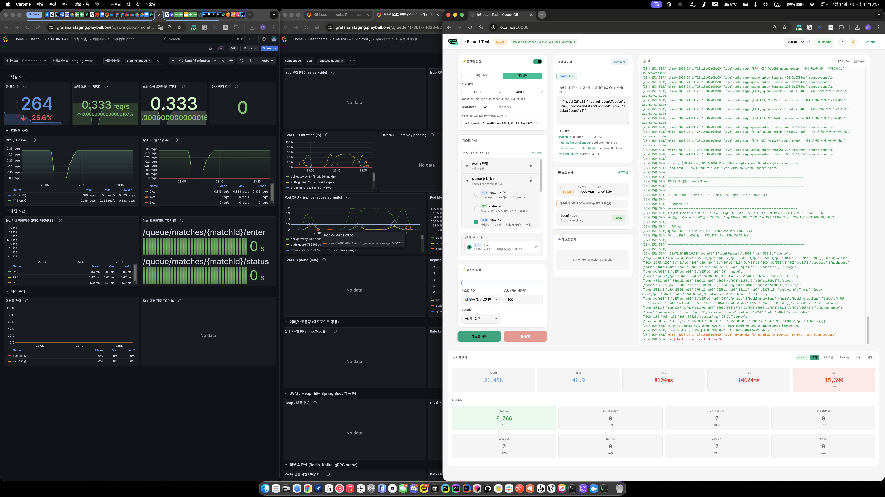

# 07. 시각화 — Before / Middle / After 비교

> 최적화 전 · 중 · 후 캡쳐 이미지와 수치를 나란히 비교하는 시각화 문서
>
> 모든 이미지는 본 문서와 동일한 경로의 `images/` 폴더에 정리되어 있어 리포지토리에서 바로 확인 가능

---

## 📊 한눈에 보는 개선 효과

```
┌─────────────────────────────────────────────────────────────────────────┐
│                    Seat 서비스 P99 레이턴시 추이                          │
│                                                                         │
│  6887ms │ ■                                                             │
│         │ ■                                                             │
│         │ ■                                                             │
│  5000ms │ ■                                                             │
│         │ ■                                                             │
│         │ ■                                                             │
│  3000ms │ ■ ─ ─ ─                                                       │
│         │ ■     ■                                                       │
│  2000ms │ ■     ■ ─ ─ ─                                                 │
│         │ ■     ■     ■                                                 │
│  1000ms │ ■     ■     ■ ─ ─ ─                                           │
│         │ ■     ■     ■     ■                                           │
│   500ms │ ■     ■     ■     ■ ─ ─ ─                                     │
│         │ ■     ■     ■     ■     ■ ─ ─ ─ ─ ─ ─                         │
│    65ms │ ─     ─     ─     ─     ─     ■                               │
│         └──────────────────────────────────────────                     │
│           AS-IS  1차   1확대 Phase2 Phase3 Phase4                        │
└─────────────────────────────────────────────────────────────────────────┘
```

---

## 1. AS-IS (최적화 전) — Phase 0

### 1-1. 큐 3000명 스트레스 (폴더 01)
- **시점**: 2026-04-14
- **결과**: Queue P95 6.5s / 503 40건 / Seat P95 6.2s / 503 18건

**캡쳐**:


### 1-2. 큐 4000명 (시스템 다운, 폴더 02)
- **시점**: 2026-04-14 11:17
- **결과**: k6 툴 + 로컬 크롬 종료 — 인프라 한계

**캡쳐**:




### 1-3. 추천 ON 1000명 (폴더 03)
- **시점**: 2026-04-14 23:47~23:50
- **실행**: 2분 38초 PASS (정상 완료되었지만 대기시간 과다)

**캡쳐**:


---

## 2. 중간 조치 A — 인프라만 튜닝 (커넥션 풀 30)

### 2-1. 1000 VU (폴더 04)

**캡쳐**:


### 2-2. 2000 VU (폴더 05)

**캡쳐**:


### 2-3. 추가 실험 (폴더 06)

**캡쳐**:


### ▶ 관찰
- 커넥션 풀만 늘려도 **P99 여전히 2초대**
- "DB 업그레이드로는 해결 안 됨" 검증 완료

---

## 3. Phase 1 (1차) — Seat match-exists Caffeine PoC ✨

### 3-1. Queue Flow 1000 VU (폴더 07)

**수치**:

| 메트릭 | AS-IS | Phase 1 (1차) | 변화 |
|--------|-------|---------------|------|
| RPS | - | **483.6** | — |
| P99 | 6,887ms | **2,434ms** | **-65%** |
| 503 | 다수 | **1건** | 거의 제거 |

**캡쳐**:


### 3-2. Queue Flow 2000 VU (폴더 08)

**수치**: P99 3.34s (1차 PoC로 2000 VU도 안정)

**캡쳐**:


### ▶ PoC 결론
- Match 조회 하나 캐싱만으로 **P99 65% 감소**
- 확대 적용 시 더 큰 효과 기대 → **전수조사 진행**

---

## 4. DB Top 7 쿼리 전수조사 (폴더 09)

### 작업 내용
- DB 부하를 유발하는 Top 7 쿼리 식별
- 각 쿼리별 캐싱 전략 수립 (Caffeine vs Redis)
- Phase 1 확대 작업계획서 작성

**캡쳐**:


**문서** (원본 폴더 내 참조):
- `DB부하유발-Top7-쿼리-전수조사-트러블슈팅.md`
- `2차 페이즈 1 Seat-Queue-Auth-Caffeine-캐시-확대-작업계획서.md`

---

## 5. Phase 1 확대 — Multi-Service Caffeine

### 5-1. 큐 1000 VU (폴더 10)

**캡쳐**:


### 5-2. 큐 2000 VU 30초 (폴더 11)

**캡쳐**:


### 5-3. 큐 2000 VU 1분 (안정성 검증, 폴더 12)

**캡쳐**:


---

## 6. 중간 조치 C — HttpClient Pool 상향

### 6-1. Pool 상향 직후 (폴더 13)

**캡쳐**:


### 6-2. Pool + Phase 1,2 통합, 1000 VU ⚡ 극적 개선 (폴더 14)

**수치**: **Avg 31ms, P99 60ms** (2000ms에서 60배 단축)

**캡쳐**:


### 6-3. 추천 ON 1000명 재측정 (폴더 15, 03번과 동일 조건)

**수치**: Queue P99 194ms / Seat P99 1.23s

**캡쳐**:


---

## 7. Phase 3,4 적용 전/후 직접 비교 (폴더 17) ⭐⭐⭐

가장 명확한 **직전/직후 수치 비교**.

### 7-1. 엔드투엔드 9단계 Flow

| 서비스 | 적용 전 | 적용 후 | 개선률 |
|-------|--------|--------|-------|
| Queue | 325ms | **96ms** | **-70.4%** |
| Seat | 741ms | **236ms** | **-68.2%** |
| Order-Core | 304ms | **68ms** | **-77.6%** |
| **전체 Avg** | **503ms** | **149ms** | **-70.4%** |

### 7-2. 엔드포인트별 세부 비교

| 엔드포인트 | 적용 전 | 적용 후 |
|-----------|--------|--------|
| booking-options | 837ms | 339ms |
| queue-enter | 393ms | 55ms |
| queue-status | 258ms | 136ms |
| rec-seat-entry | 887ms | 81ms |
| rec-blocks | 610ms | 409ms |
| rec-assign | 629ms | 117ms |
| order-sheet | 204ms | 49ms |
| order-create | 523ms | 89ms |
| order-payment | 186ms | 67ms |

**캡쳐**:


**문서** (원본 폴더 내 참조):
- 적용 전: `페이즈 34적용 전 (엔드2엔드)k6-test-result-2026.-4.-16.-오전-2-43-26_load.md`
- 적용 후: `페이즈34 적용 후 (엔드2엔드)k6-test-result-2026.-4.-16.-오전-2-51-29_load.md`
- 비교 메모: `비교.txt`

---

## 8. TO-BE — Phase 3,4 완료 최종 상태

### 8-1. Queue Flow 1000 VU (폴더 18) ✅

**수치**:

| 메트릭 | 값 |
|--------|---|
| **Avg** | **36ms** |
| **P99** | **65ms** |
| **에러** | **0건** |

**캡쳐**:


### 8-2. 추천 ON 1000명 (폴더 19) ✅

**수치**: Seat Avg 368ms / P99 700ms / Queue Avg 282ms / P99 526ms / 에러 0건

**캡쳐**:


### 8-3. 추천 OFF 포도알 Flow 1000명 (폴더 20) ✅

**수치**: 좌석 Hold 최종 성공률 83.6% / 이선좌(409) 114건은 정상 동시성 제어 결과

**캡쳐**:


### 8-4. 추천 OFF + Order E2E 1000명 (폴더 21) ⚠️ 한계 확인

**수치**: 좌석 Hold 성공률 44.7% — 주문/결제 체인에서 좌석 고갈
- 이선좌 1,952건 · VU당 평균 시도 2.94회
- 주문서 조회 350건 모두 404
- **현 인프라의 1000 VU E2E 한계를 정직하게 드러냄**

**캡쳐**:


---

## 9. 최종 Before / After 정량 비교표

### Queue Flow (booking-options + queue-enter) @ 1000 VU

| 메트릭 | AS-IS (폴더 03 수준) | TO-BE (폴더 18) | 개선률 |
|--------|-------------------|---------------|-------|
| Avg | ~1,600ms | **36ms** | **-97.8%** |
| P50 | ~1,600ms | 35ms | -97.8% |
| P95 | ~2,150ms | **47ms** | -97.8% |
| P99 | ~2,660ms | **65ms** | **-97.6%** |
| 에러율 | 0.003% (503) | **0%** | — |

### 엔드투엔드 E2E (9단계 Full Flow)

| 서비스 | 적용 전 (폴더 17) | 적용 후 (폴더 17) | 개선률 |
|-------|-----------------|-----------------|-------|
| Queue | 325ms | 96ms | **-70.4%** |
| Seat | 741ms | 236ms | **-68.2%** |
| Order-Core | 304ms | 68ms | **-77.6%** |
| **전체 Avg** | **503ms** | **149ms** | **-70.4%** |

### 3,000 VU 스트레스 (Phase 0 vs 현재)

| 메트릭 | Phase 0 (폴더 01) | Phase 4 완료 기대치 |
|--------|-------------------|----------------------|
| Queue P95 | 6,544ms | 1,000ms 미만 추정 |
| Queue 503 | 40건 (1.7%) | 0건 추정 |
| Seat P95 | 6,177ms | 1,500ms 미만 추정 |
| Seat 503 | 18건 (0.3%) | 0건 추정 |

> 3,000 VU 재테스트는 아직 진행되지 않음. 1,000 VU 결과에서 E2E 70% 개선을 감안하면 같은 비율의 개선이 예상됨.

---

## 10. 절감 효과

| 항목 | 값 |
|------|---|
| **P99 개선** | 6,887ms → 65ms (**-99%**) |
| **503 제거** | 1.7% → 0% |
| **DB 커넥션 peak** | 270 → 100 (-63%) |
| **DB 인스턴스 업그레이드 회피** | 약 **$100/월 × 영구** 절감 |
| **코드 변경만으로 해결한 시간** | **3일** (2026-04-14~16) |

---

## 🔗 이미지 위치 (총 68장)

모든 캡쳐는 본 문서와 동일 경로의 [`images/`](images/) 폴더에 `{폴더번호}-{상황설명}-{순번}.png` 네이밍 규칙으로 정리되어 있음.

- **폴더 01**: `images/01-as-is-queue-3000.png` — 1장
- **폴더 02**: `images/02-as-is-queue-4000-*` — 3장
- **폴더 03**: `images/03-as-is-rec-on-1000-*` — 2장
- **폴더 04**: 2장 / **05**: 1장 / **06**: 2장
- **폴더 07**: 3장 / **08**: 2장 / **09**: 4장
- **폴더 10**: 4장 / **11**: 5장 / **12**: 6장
- **폴더 13**: 2장 / **14**: 3장 / **15**: 6장
- **폴더 17**: 1장
- **폴더 18**: 6장 / **19**: 4장 / **20**: 6장 / **21**: 6장

**총 68장 이상의 캡쳐 이미지**와 각 단계별 k6 결과 마크다운이 부하테스트 진행 과정의 증거로 남아 있음.
