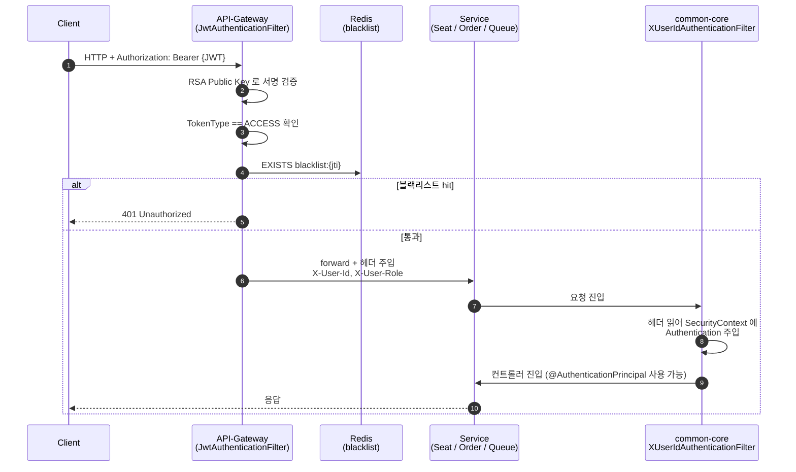
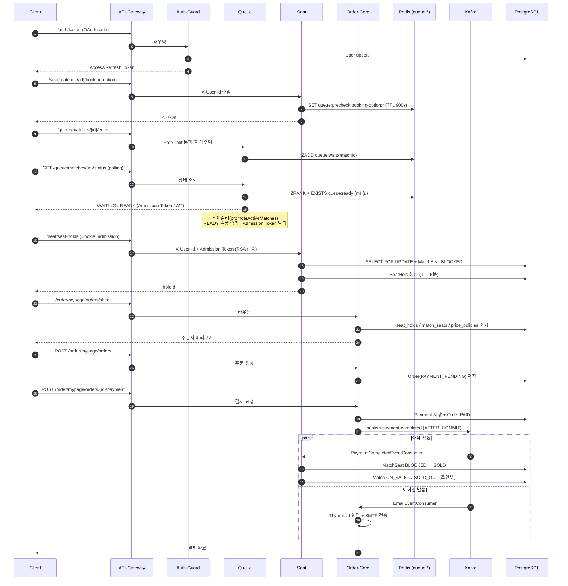

# GoormGB Backend — MSA 아키텍처 (현재 코드 기반)

> 실제 레포지토리 코드(`/102-goormgb-backend`) 를 직접 탐색하여 확인한 **현재 구현 상태** 기준 문서입니다.
> 추측이 들어간 항목은 `(추정)` 으로 표기하였으며, 릴리즈 노트·과거 설계서의 미구현 계획은 포함하지 않았습니다.

| 항목 | 값 |
|---|---|
| 문서 버전 | v1.0 (현재 코드 기준) |
| 갱신일 | 2026-04-20 |
| 기준 브랜치 | `staging` |
| 대상 커밋 | `7426766` (`chore: v1.14.0-staging 릴리즈 노트 추가 및 가이드 문서 정리`) |
| 서비스 수 | 6개 (API-Gateway · Auth-Guard · Queue · Seat · Order-Core · common-core) |
| 엔티티 수 | 27개 (5개 Bounded Context) |
| Kafka 토픽 수 | 4개 (+ 각 토픽의 DLT) |

---

## 1. 전체 구조 요약

```
                        ┌───────────────────┐
                        │     Client (Web)  │
                        └─────────┬─────────┘
                                  │ HTTPS (JWT Bearer)
                                  ▼
                        ┌───────────────────┐
                        │   API-Gateway     │  :8085  WebFlux
                        │  - JWT 검증       │
                        │  - X-User-Id 주입 │
                        │  - Rate Limiter   │
                        └─┬───┬───┬───┬─────┘
                          │   │   │   │
             ┌────────────┘   │   │   └─────────────┐
             ▼                ▼   ▼                 ▼
       ┌──────────┐    ┌──────────┐  ┌──────────┐  ┌──────────────┐
       │AuthGuard │    │  Queue   │  │   Seat   │  │  Order-Core  │
       │  :8080   │    │  :8081   │  │  :8082   │  │    :8083     │
       │ WebMVC   │    │ WebMVC   │  │ WebMVC   │  │   WebMVC     │
       └────┬─────┘    └────┬─────┘  └────┬─────┘  └──────┬───────┘
            │               │             │                │
            │  (공유 라이브러리: `:common-core`)                │
            └───────────────┴─────────────┴────────────────┘
                                  │
   ┌──────────────────────────────┼──────────────────────────────┐
   ▼                              ▼                              ▼
┌─────────────────┐     ┌──────────────────┐         ┌────────────────────┐
│ PostgreSQL 16   │     │  Redis 7 (공용)    │         │   Kafka 3.7.1       │
│  `goormgb`      │     │   6379  — 캐시/   │         │  - 4 topics + DLT   │
│  (5개 서비스 공유)│     │         세션/락   │         │  - 3 partitions     │
│                 │     │  6380  — Queue   │         │  - retention 72h     │
│  27 entities    │     │         전용 대기열│         │                     │
└─────────────────┘     └──────────────────┘         └────────────────────┘
        ▲                        ▲
        │                        │
        └────── 서비스 간 데이터는 직접 호출(REST) 이 아닌,
                DB(공유) · Redis(공유) · Kafka(이벤트) 로만 교환됨
```

서비스 사이에는 **직접 동기 REST 호출이 존재하지 않습니다.** 데이터 교환은
- 공유 PostgreSQL 테이블,
- 공유 Redis 키 (+ Queue 전용 Redis 인스턴스),
- Kafka 이벤트 토픽

세 가지 경로로만 이루어집니다.

---

## 2. 공통 레이어 패턴

각 서비스는 `common-core` 라이브러리 의존(`implementation project(':common-core')`) 위에서
다음과 같은 전형적인 Spring Boot 3-레이어 구조를 따릅니다.

```
[HTTP In]
    │
    ▼
 ┌───────────────────────────────────────────────────────────┐
 │ Controller  (@RestController, @RequestMapping)              │
 │   - DTO Request → Service 호출 → ApiResult<T> 반환         │
 └──────────────────────────┬────────────────────────────────┘
                            ▼
 ┌───────────────────────────────────────────────────────────┐
 │ Service     (@Service, @Transactional)                     │
 │   - 도메인 규칙, 트랜잭션 경계                              │
 │   - Repository / Kafka Publisher / Redis 호출              │
 └──────────────────────────┬────────────────────────────────┘
                            ▼
 ┌───────────────────────────────────────────────────────────┐
 │ Repository  (Spring Data JPA, Redis Template)              │
 │   - PostgreSQL 접근, JPQL / Native                         │
 └──────────────────────────┬────────────────────────────────┘
                            ▼
                      Entity  /  DTO (record, class)
```

공통 약속:

- **예외 응답 포맷**: `common-core/global/response/ApiResult<T>` 로 성공/실패 포장,
  `GlobalExceptionHandler` 에서 `CustomException` + `ErrorCode` 를 401/404/409 등으로 매핑
- **인증 주입**: `X-User-Id`, `X-User-Role` 헤더 → `XUserIdAuthenticationFilter` 가 `SecurityContext` 세팅
- **시간대**: 모든 서비스가 `spring.jackson.time-zone: UTC`, Hibernate `jdbc.time-zone: UTC`
- **감사 필드**: `BaseEntity` (createdAt/updatedAt) 를 엔티티 대부분이 상속

---

## 3. 모듈별 내부 구조

### 3.1 API-Gateway — `:8085`

```
API-Gateway/src/main/java/com/goormgb/be/apigateway
├── ApiGatewayApplication.java
├── config/
│   ├── GatewayObservationConfig
│   └── UserOrIpKeyResolverConfig       # Rate limiter KeyResolver
├── filter/
│   ├── BotUserAgentBlockFilter
│   ├── CorsGlobalFilter                # CORS, OPTIONS 처리
│   ├── JwtAuthenticationFilter         # JWT 검증 + X-User-Id 주입
│   ├── RateLimitMonitoringFilter
│   └── RateLimitingFilter
└── jwt/
    ├── config/JwtProperties
    ├── enums/TokenType
    ├── provider/JwtTokenProvider
    ├── repository/AccessTokenBlacklistRepository  # Reactive Redis
    └── util/RsaKeyUtils
```

| 항목 | 값 |
|---|---|
| 스택 | Spring Cloud Gateway **WebFlux** (`spring-cloud-starter-gateway-server-webflux`) |
| Spring Cloud BOM | `2025.1.1` |
| JWT 라이브러리 | `io.jsonwebtoken:jjwt 0.13.0` |
| 저장소 | Redis (Reactive) — Access Token 블랙리스트 |
| 라우트 | `/auth/**`, `/queue/**`, `/seat/**`, `/order/**` + `/queue/matches/*/enter` 전용 Rate Limiter |
| 포트 | `${SERVER_PORT:8085}` |

`spring-boot-starter-web` 은 `exclude group` 으로 **완전 차단**(Gradle `configurations.all`) — WebFlux 단일 스택을 보장합니다.

---

### 3.2 Auth-Guard — `:8080` (context-path `/auth`)

```
Auth-Guard/src/main/java/com/goormgb/be/authguard
├── AuthGuardApplication.java
├── auth/
│   ├── client/
│   ├── controller/   (Auth, DevAuth, LoadTestAuth, User)
│   ├── dto/
│   └── service/
├── kakao/
│   ├── client/  config/  controller/(KakaoAuth)  dto/  service/
├── jwt/
│   ├── config/  enums/  filter/  init/  provider/  repository/  util/
├── filter/
├── metrics/
└── config/
```

| 항목 | 값 |
|---|---|
| 스택 | Spring Boot 4.0.2 WebMVC + Spring Security + JPA + Redis + Session-Data-Redis |
| JWT 라이브러리 | `jjwt 0.13.0` |
| 저장소 | PostgreSQL(User, UserSns, DevUser, LoadTestUser, WithdrawalRequest) / Redis(Refresh token, Access token 블랙리스트) |
| 외부 연동 | Kakao OAuth (`kauth.kakao.com`, `kapi.kakao.com`) |
| Kafka | Producer (`user-blocked` 발행 가능 설정) |
| 포트 | `${SERVER_PORT:8080}` |

---

### 3.3 Queue — `:8081` (context-path `/queue`)

```
Queue/src/main/java/com/goormgb/be/queue
├── QueueApplication.java
├── config/
├── metrics/
└── queue/
    ├── controller/   (QueueController)
    ├── dto/response/
    ├── enums/
    ├── model/
    ├── policy/
    ├── repository/
    ├── scheduler/    (promoteActiveMatches, ready slot 회수)
    ├── security/     (Admission Token 발급용 RSA Provider)
    ├── service/
    └── util/
```

| 항목 | 값 |
|---|---|
| 스택 | Spring Boot 4.0.2 WebMVC + JPA + Redis + Caffeine + Redis Reactive |
| 분산 락/재시도 | `resilience4j-spring-boot3 2.2.0` (prequeue 마커 재시도) |
| JWT | `jjwt 0.12.7` (Admission Token **발급용 RSA Private Key**) |
| 저장소 | PostgreSQL(Match 검증용) / **Queue 전용 Redis (6380)** |
| Redis 키 | `queue:wait:{matchId}` SortedSet, `queue:ready:{m}:{u}`, `queue:expired:{m}:{u}`, `queue:match` Set, `queue:ready:index:{m}`, `queue:precheck:booking-option:*` |
| TTL 설정 | `ready-ttl-seconds: 60`, `admission-ttl-seconds: 900`, `expired-marker-ttl-seconds: 300` |
| 포트 | `${SERVER_PORT:8081}` |

---

### 3.4 Seat — `:8082` (context-path `/seat`)

```
Seat/src/main/java/com/goormgb/be/seat
├── SeatApplication.java
├── area/            (Area 엔티티)
├── block/           (Block 엔티티 + Controller/Service)
├── booking/         (BookingOptions Controller/Service — Redis 캐시)
├── common/          (공통 Controller, DTO, 분산 락 서비스)
│   └── service/lock/
├── config/          (KafkaConsumerConfig 포함)
├── matchSeat/
│   ├── entity/MatchSeat
│   ├── event/       (PaymentCompleted/OrderCancelled/BankTransferExpired Consumer)
│   ├── scheduler/
│   └── service/
├── pricePolicy/     (PricePolicy 엔티티)
├── recommendation/  (AI 추천 좌석 — Controller/Service/DTO)
├── redis/
├── seat/            (Seat 엔티티)
├── seatHold/        (SeatHold 엔티티 + 만료 스케줄러)
├── section/         (Section 엔티티)
├── security/
└── metrics/
```

| 항목 | 값 |
|---|---|
| 스택 | Spring Boot 4.0.2 WebMVC + JPA + Redis + Caffeine |
| 분산 락 | **Redisson 3.44.0** (`redisson:3.44.0` — starter 대신 core 직접 사용: Spring Boot 4 호환) |
| JWT 검증 | `jjwt 0.12.7` (Admission Token **RSA Public Key** 로 검증만) |
| 저장소 | PostgreSQL(MatchSeat, Seat, Section, Area, Block, SeatHold, PricePolicy) / Redis (BookingOptions 캐시 TTL 900s, seat-groups-response 캐시) |
| Kafka | **Consumer**: `payment-completed`, `order-cancelled`, `bank-transfer-expired` (group-id: `seat-service`) |
| 이중 Redis | `data.redis.*` (6379, 일반) + `prequeue.redis.*` (6380, Queue 프리체크 공유) |
| 포트 | `${SERVER_PORT:8082}` |

---

### 3.5 Order-Core — `:8083` (context-path `/order`)

```
Order-Core/src/main/java/com/goormgb/be/ordercore
├── OrderCoreApplication.java
├── cancellation/    (CancellationFeePolicy)
├── club/            (Club 조회 Controller)
├── config/          (KafkaConsumerConfig)
├── email/           (SMTP + Thymeleaf, Kafka Listener)
│   ├── event/EmailEventConsumer   # payment-completed / order-cancelled 수신
│   └── service/(EmailService, EmailSendGuard)
├── filter/
├── inquiry/         (Inquiry, InquiryAnswer)
├── match/           (Match 조회 · 스케줄러)
├── mypage/          (주문/결제 내역 · 쿼리 모델)
├── onboarding/      (선호 설정 Controller/Service)
├── order/
│   ├── entity/(Order, OrderSeat)
│   ├── event/(OrderEventPublisher, UserBlockedEventConsumer, OrderCancelledInternalEvent)
│   └── query/
├── payment/
│   ├── entity/(Payment, CashReceipt)
│   ├── event/(PaymentEventPublisher, Internal events)
│   └── scheduler/(BankTransferCancelService, BankTransferExpireScheduler)
├── qrtoken/         (QrToken)
├── user/            (UserService — Kafka user-blocked 처리 후 사이드이펙트)
└── metrics/
```

| 항목 | 값 |
|---|---|
| 스택 | Spring Boot 4.0.2 WebMVC + JPA + Redis + Caffeine + Thymeleaf + Mail |
| Kafka | **Producer**: `payment-completed`, `order-cancelled`, `bank-transfer-expired`<br>**Consumer**: `user-blocked` (group-id: `order-core-notification`), `payment-completed`/`order-cancelled` (이메일 발송) |
| 저장소 | PostgreSQL(Order, OrderSeat, Payment, CashReceipt, Inquiry, InquiryAnswer, QrToken, CancellationFeePolicy) — **Seat 서비스 소유 테이블(MatchSeat, PricePolicy)을 직접 조회** |
| 외부 연동 | SMTP (예매 확정/결제 완료/주문 취소 메일) |
| 포트 | `${SERVER_PORT:8083}` |

> 참고: `OrderEventPublisher` 는 **내부 Spring Event → `@TransactionalEventListener(AFTER_COMMIT)` → KafkaTemplate.send()** 구조로 트랜잭션 커밋 이후 Kafka 발행을 보장합니다.

---

### 3.6 common-core — 라이브러리 (bootJar 없음)

```
common-core/src/main/java/com/goormgb/be
├── domain/           # Bounded Context 가로지르는 공유 엔티티
│   ├── club/         (Club + Repository)
│   ├── match/        (Match + Repository + enums + support)
│   ├── onboarding/   (OnboardingPreference, OnboardingPreferredBlock, OnboardingViewpointPriority)
│   ├── stadium/      (Stadium)
│   ├── state/        (TeamSeasonStats)
│   └── ticket/enums/
├── global/
│   ├── config/       (JpaAuditing, Redis, Swagger, Metrics)
│   ├── encryption/   (DB 컬럼 암호화)
│   ├── entity/BaseEntity
│   ├── environment/
│   ├── exception/    (CustomException, ErrorCode, GlobalExceptionHandler)
│   ├── request/
│   ├── response/ApiResult
│   ├── security/filter/XUserIdAuthenticationFilter
│   ├── support/      (Preconditions)
│   └── util/         (RsaKeyUtils)
├── kafka/
│   ├── EventTopic                  # 토픽 상수
│   ├── KafkaTopicConfig            # NewTopic Bean 정의 (@ConditionalOnProperty)
│   └── event/(PaymentCompletedEvent, OrderCancelledEvent,
│              BankTransferExpiredEvent, UserBlockedEvent)
├── logging/
├── metrics/
└── user/               (User, UserSns, DevUser, LoadTestUser, WithdrawalRequest)
```

| 항목 | 값 |
|---|---|
| 종류 | Gradle `java-library` + `java-test-fixtures` (실행 불가) |
| 전이 의존 (`api`) | JPA / Security / Redis / Validation / Kafka / WebMVC / springdoc-openapi-starter-webmvc-ui 3.0.1 |
| 사용 서비스 | Auth-Guard · Queue · Seat · Order-Core (전체) |

---

## 4. 서비스 간 통신 구조

| 경로 | 수단 | 관찰된 코드 |
|---|---|---|
| API-Gateway → 모든 서비스 | HTTP 프록시 라우팅 | `application.yaml` `spring.cloud.gateway.server.webflux.routes` |
| Queue → 클라이언트 → Seat | **Admission Token (JWT, RSA256)** | `Queue/queue/security/*` 발급, `Seat/security/*` 검증 |
| Auth-Guard ↔ API-Gateway | 공유 Redis — 블랙리스트 JTI | `AccessTokenBlacklistRepository` (Reactive) |
| Seat ↔ Queue | 공유 Redis (프리체크 키) | `queue:precheck:booking-option:*` (Seat 가 쓰고 Queue 가 본다) |
| Order-Core → Seat | **공유 PostgreSQL 테이블 직접 조회** | `MatchSeat`, `PricePolicy` 를 JPA 로 Order-Core 가 직접 read |
| Order-Core ↔ Seat | **Kafka 이벤트** | `payment-completed`, `order-cancelled`, `bank-transfer-expired` |
| Order-Core → Order-Core (email) | 자기 자신의 Kafka 토픽 재구독 | 같은 프로세스가 다른 consumer group 으로 수신 |
| Auth-Guard → Order-Core/모든 구독자 | Kafka `user-blocked` | `UserBlockedEvent` |

**직접 호출(RestTemplate/Feign/WebClient) 로 서비스 간 통신하는 코드는 현재 존재하지 않습니다.**
외부 RestTemplate 호출은 Auth-Guard → Kakao OAuth 한 건뿐입니다.

---

## 5. 인증 흐름 — X-User-Id 주입 기반



토큰/키 관리 요약:

| 토큰 | 발급 | 검증 | 저장소 |
|---|---|---|---|
| Access Token (RSA256) | Auth-Guard | API-Gateway (Public Key) | 클라이언트 보관, 블랙리스트는 Redis |
| Refresh Token (RSA256) | Auth-Guard | Auth-Guard | Redis + 클라이언트 |
| Admission Token (RSA256) | Queue | Seat (Public Key) | HTTP Cookie, TTL 자동 만료 |

---

## 6. 데이터 저장소 접근 요약

### 6.1 PostgreSQL — 단일 인스턴스 `goormgb` 공유

| Bounded Context | 소유 서비스 (쓰기) | 읽기 공유 서비스 |
|---|---|---|
| `users`, `user_sns`, `dev_user`, `load_test_user`, `withdrawal_request` | Auth-Guard | Order-Core (join 용 read) |
| `club`, `match`, `stadium`, `team_season_stats`, `onboarding_*` | Order-Core / Queue (도메인 master 구분 없이 read 중심) | Seat, Queue |
| `match_seat`, `seat`, `section`, `area`, `block`, `price_policy`, `seat_hold` | Seat | **Order-Core 가 read 용도로 직접 조회** |
| `order`, `order_seat`, `payment`, `cash_receipt`, `qr_token`, `inquiry`, `inquiry_answer`, `cancellation_fee_policy` | Order-Core | — |

> Hibernate `ddl-auto: update` 가 모든 서비스에 켜져 있어 각 서비스 기동 시 자기 소유 엔티티 스키마를 동기화합니다.

### 6.2 Redis — 2 인스턴스 (로컬/dev 기준, 운영은 ElastiCache 1대 공유)

| 인스턴스 | 포트 | 주요 키 (실제 코드 기준) | 사용 서비스 |
|---|---|---|---|
| `local-redis` | 6379 | `blacklist:{jti}` (Gateway, Reactive) · Refresh/Access 토큰 (Auth-Guard) · `seat:booking-options:*` (TTL 900s) · `seat-groups-response` 캐시 · 범용 세션 | API-Gateway, Auth-Guard, Seat, Order-Core |
| `queue-redis` | 6380 | `queue:wait:{matchId}` (ZSET) · `queue:ready:{m}:{u}` · `queue:expired:{m}:{u}` · `queue:match` (SET) · `queue:ready:index:{m}` · `queue:precheck:booking-option:*` | Queue (쓰기/읽기), Seat (프리체크 마커 쓰기) |

---

## 7. Kafka EDA 구조

`common-core/kafka/KafkaTopicConfig` 에 선언된 토픽 Bean (`@ConditionalOnProperty("spring.kafka.bootstrap-servers")`) 기준입니다. **DLT(`.DLT`) 가 각 주요 토픽마다 1:1 생성**됩니다.

### 7.1 실제 구현된 토픽 (4개 + DLT 3개)

| 토픽 | 파티션 | Replicas | Producer | Consumer (group-id) |
|---|---|---|---|---|
| `payment-completed` | 3 | 1 | Order-Core (`PaymentEventPublisher`) | Seat (`seat-service`) — 좌석 SOLD 처리<br/>Order-Core (`order-core-notification`) — 메일 발송 |
| `payment-completed.DLT` | 3 | 1 | (재시도 실패 시 자동) | — |
| `order-cancelled` | 3 | 1 | Order-Core (`OrderEventPublisher`) | Seat (`seat-service`) — 좌석 AVAILABLE 복귀<br/>Order-Core (`order-core-notification`) — 취소 메일 |
| `order-cancelled.DLT` | 3 | 1 | (재시도 실패 시 자동) | — |
| `bank-transfer-expired` | 3 | 1 | Order-Core (스케줄러) | Seat (`seat-service`) — 좌석 해제 |
| `bank-transfer-expired.DLT` | 3 | 1 | (재시도 실패 시 자동) | — |
| `user-blocked` | 3 | 1 | Auth-Guard (설정상 Producer 가능) | Order-Core (`UserBlockedEventConsumer`) |

> 참고: Seat 의 "Hold 완료" 같은 내부 이벤트는 **Redis 슬롯 회수 + 내부 스케줄러** 로 처리되고 있으며, **별도의 `seat-hold-completed` Kafka 토픽은 현재 레포에 없습니다(미구현).**

### 7.2 발행 패턴 — Transactional Outbox (in-memory)

Order-Core 의 Publisher 들은 **Spring `ApplicationEventPublisher` → `@TransactionalEventListener(AFTER_COMMIT)` → `KafkaTemplate.send()`** 순서를 사용합니다. DB 트랜잭션 커밋 이후에만 Kafka 로 넘어가므로, 롤백 시 유령 이벤트 발행이 방지됩니다.

```
[Order-Core 트랜잭션]
  save(Order)  save(Payment)
      │
      └──▶ applicationEventPublisher.publishEvent(PaymentCompletedInternalEvent)
                │
                ▼  AFTER_COMMIT
           kafkaTemplate.send("payment-completed", event)
                │
     ┌──────────┴──────────┐
     ▼                     ▼
[Seat Consumer]    [Order-Core email Consumer]
  MatchSeat SOLD       사용자 메일 발송
```

---

## 8. 티켓팅 전체 시퀀스



---

## 9. 엔티티 개요 (27개 · 5 Bounded Contexts)

### 9.1 User Context (5) — `common-core/user`
`User`, `UserSns`, `DevUser`, `LoadTestUser`, `WithdrawalRequest`

### 9.2 Match/Catalog Context (7) — `common-core/domain`
`Club`, `Match`, `Stadium`, `TeamSeasonStats`, `OnboardingPreference`, `OnboardingPreferredBlock`, `OnboardingViewpointPriority`

### 9.3 Seat Context (7) — `Seat` 모듈
`MatchSeat`, `Seat`, `Section`, `Area`, `Block`, `SeatHold`, `PricePolicy`

### 9.4 Order/Payment Context (8) — `Order-Core` 모듈
`Order`, `OrderSeat`, `Payment`, `CashReceipt`, `QrToken`, `CancellationFeePolicy`, `Inquiry`, `InquiryAnswer`

### 9.5 Infra/Base
`BaseEntity` (공용, createdAt/updatedAt · `common-core/global/entity`)

---

## 10. 출처 · 참고

실제 탐색한 코드 · 설정 파일 경로 (모두 `/Users/goorm/Desktop/Project/102-goormgb-backend` 하위):

**빌드/설정**
- `build.gradle`, `settings.gradle`
- `API-Gateway/build.gradle`
- `Auth-Guard/build.gradle`
- `Queue/build.gradle`
- `Seat/build.gradle`
- `Order-Core/build.gradle`
- `common-core/build.gradle`

**런타임 구성**
- `API-Gateway/src/main/resources/application.yaml`
- `Auth-Guard/src/main/resources/application.yaml`
- `Queue/src/main/resources/application.yaml`
- `Seat/src/main/resources/application.yaml`
- `Order-Core/src/main/resources/application.yaml`
- `docker/docker-compose.yml`
- `docker/docker-compose.dev.yml`

**코드 (주요)**
- `API-Gateway/src/main/java/com/goormgb/be/apigateway/filter/JwtAuthenticationFilter.java`
- `API-Gateway/src/main/java/com/goormgb/be/apigateway/jwt/repository/AccessTokenBlacklistRepository.java`
- `common-core/src/main/java/com/goormgb/be/global/security/filter/XUserIdAuthenticationFilter.java`
- `common-core/src/main/java/com/goormgb/be/kafka/EventTopic.java`
- `common-core/src/main/java/com/goormgb/be/kafka/KafkaTopicConfig.java`
- `common-core/src/main/java/com/goormgb/be/kafka/event/PaymentCompletedEvent.java`
- `common-core/src/main/java/com/goormgb/be/kafka/event/OrderCancelledEvent.java`
- `common-core/src/main/java/com/goormgb/be/kafka/event/BankTransferExpiredEvent.java`
- `common-core/src/main/java/com/goormgb/be/kafka/event/UserBlockedEvent.java`
- `Order-Core/src/main/java/com/goormgb/be/ordercore/order/event/OrderEventPublisher.java`
- `Order-Core/src/main/java/com/goormgb/be/ordercore/email/event/EmailEventConsumer.java`
- `Seat/src/main/java/com/goormgb/be/seat/matchSeat/event/PaymentCompletedEventConsumer.java`
- `Seat/src/main/java/com/goormgb/be/seat/matchSeat/event/OrderCancelledEventConsumer.java`
- `Seat/src/main/java/com/goormgb/be/seat/matchSeat/event/BankTransferExpiredEventConsumer.java`

**참고 문서(문체/구성 참고)**
- `docs/아키텍쳐/msa-architecture-overview.md`
- `docs/inner-architecture.md`
